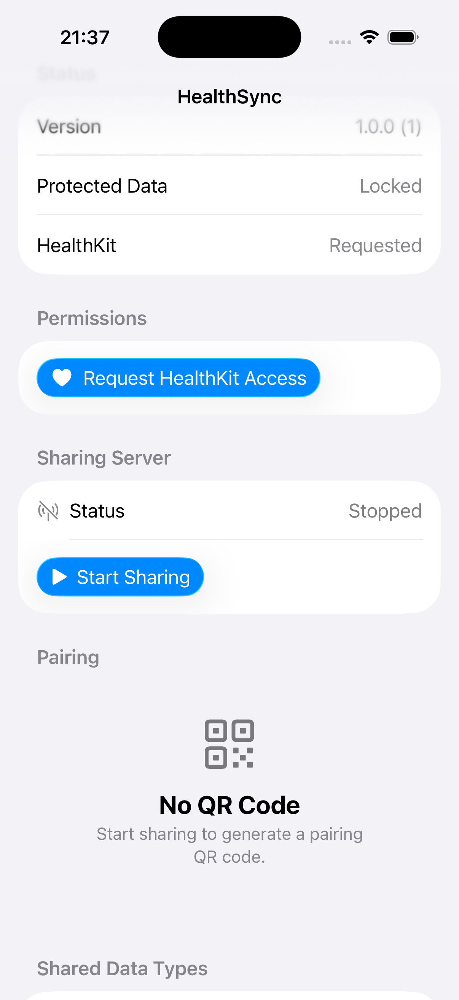
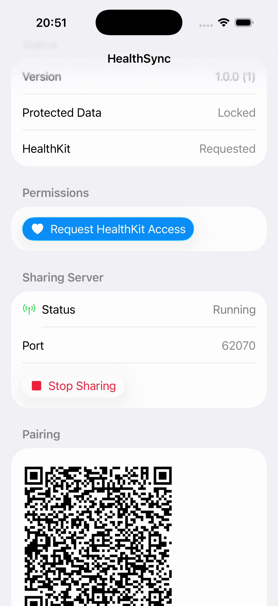

# Pair Devices: How to Connect iPhone and Mac

**Establish secure device-to-device connection using QR code pairing**

---

**Time:** 5 minutes
**Difficulty:** Beginner
**Prerequisites:**
- [ ] iOS app running on iPhone/simulator
- [ ] macOS CLI built and available
- [ ] Both devices on same network

> **Video Demo:** See [Pairing Video Guide](../tutorials/pairing-video-guide.md) for a visual walkthrough (18 seconds).

---

## Goal

Pair your iOS device with your Mac so they can communicate securely using mutual TLS authentication.

---

## Steps

### Step 1: Start Sharing and Generate QR Code

1. Open the **HealthSync** app on your iPhone
2. Optionally tap **"Request HealthKit Access"** to grant permissions
3. Tap **"Start Sharing"** button
4. QR code generates automatically and displays

**Expected:**
- Status shows **"Running"** with port number (e.g., 62070)
- QR code appears with pairing code and expiration time




**Important:** QR code expires after 5 minutes. Tap **"Refresh Code"** to generate a new one.

---

### Step 2: Scan QR Code with CLI

**Option A: Automatic Scan (from clipboard)**

```bash
# On iOS device, copy the QR code text
# Long press QR code → Copy

# On Mac, scan from clipboard
healthsync scan
```

**Option B: Manual Scan (from image)**

```bash
# Take screenshot of QR code on iOS device
# Then scan from image file
healthsync scan --image /path/to/screenshot.png
```

**Option C: Manual Token Entry**

```bash
# Type pairing token manually
healthsync pair --token abc123def456
```

---

### Step 3: Verify Pairing

**On CLI:**
```bash
healthsync status
```

**Expected output:**
```
📡 Connection Status: ✅ Paired
📱 Device: iPhone 16 Simulator
🔒 Secure: Yes (mTLS)
🔐 Fingerprint: SHA256:abc123def456...
📊 Enabled: 27 data types
📦 Version: 1.0.0
```

**On iOS App:**
- Server status shows **"Running"**
- QR code remains visible for additional pairings

---

## Verification

**Test the connection:**

```bash
# Fetch health data to verify connection works
healthsync fetch --types steps --limit 1
```

**Success:** Data is returned without errors.

**Failure:** See [Troubleshooting](#troubleshooting) below.

---

## Common Issues

### Issue: "Device Not Found"

**Cause:** iOS server not running or not on same network.

**Solution:**
1. Verify iOS server is running
2. Check both devices on same Wi-Fi
3. Disable VPN if enabled
4. Try: `healthsync discover --verbose`

### Issue: "Pairing Token Expired"

**Cause:** QR code older than 5 minutes.

**Solution:**
1. Generate new QR code in iOS app
2. Scan immediately with CLI

### Issue: "Certificate Verification Failed"

**Cause:** Certificate mismatch or corrupted.

**Solution:**
```bash
# Clear stored certificates
healthsync unpair

# Try pairing again
healthsync scan
```

---

## Unpairing Devices

**To remove pairing:**

```bash
# From CLI - clears stored certificates
healthsync unpair
```

**From iOS app:**
1. Tap **"Stop Sharing"** to stop the server
2. Delete and reinstall app to reset all certificates

---

## Security Notes

**What happens during pairing:**

1. **iOS generates certificate:**
   - Creates private/public key pair
   - Stores in Keychain
   - Shares public certificate via QR code

2. **Mac generates certificate:**
   - Creates its own key pair
   - Stores in local Keychain
   - Sends public certificate to iOS

3. **Mutual verification:**
   - Both devices verify peer certificates
   - mTLS handshake established
   - All further communication encrypted

**Certificate storage:**
- **iOS:** Keychain (protected by device passcode/biometrics)
- **Mac:** User Keychain (protected by system login)

---

## See Also

- [Generate Certificates](./generate-certificates.md) - Manual certificate creation
- [Troubleshooting Pairing](../TROUBLESHOOTING.md#pairing-problems) - Common pairing issues
- [Security Overview](../explanation/security-model.md) - How security works

---

**Last Updated:** 2026-01-07
