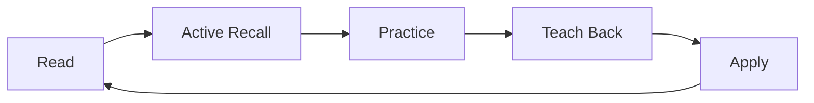
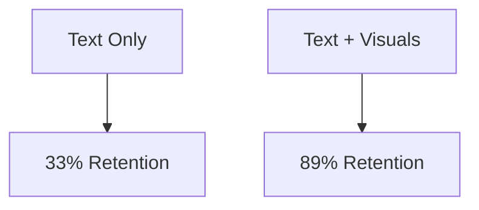
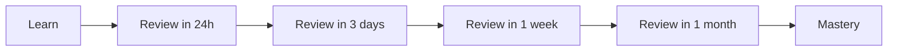
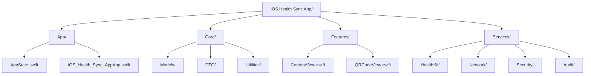

# Welcome to the iOS Health Sync Learning Guide

**A Comprehensive Tutorial for Junior Developers**

---

## 📚 Table of Contents

| Chapter | Title | Focus | Time |
|---------|-------|-------|------|
| [00](#welcome-to-the-ios-health-sync-learning-guide) | **Welcome & Learning Guide** | How to use this guide | 15 min |
| [01](01-overview.md) | **What This App Does & Why It Matters** | The big picture | 45 min |
| [02](02-architecture.md) | **Understanding The Architecture** | How it's organized | 60 min |
| [03](03-swift6.md) | **Swift 6 - The Foundation** | Modern Swift patterns | 75 min |
| [04](04-swiftui.md) | **Building User Interfaces with SwiftUI** | Declarative UI | 60 min |
| [05](05-swiftdata.md) | **Persisting Data with SwiftData** | Data persistence | 45 min |
| [06](06-healthkit.md) | **Working with HealthKit** | Health data access | 60 min |
| [07](07-security.md) | **Security - Protecting Health Data** | Security patterns | 75 min |
| [08](08-networking.md) | **Networking - Device Communication** | Network programming | 90 min |
| [09](09-cli.md) | **macOS CLI Companion** | Command-line tools | 45 min |
| [10](10-testing.md) | **Testing Your Code** | Testing patterns | 60 min |

**Total Time:** ~12 hours (spread over 4 weeks recommended)

---

## 🎯 How This Guide Works

### The Active Learning Framework

This guide uses **active learning** based on 2025 cognitive science research. You don't just read—you **do**.



**The Learning Loop:**

1. **📖 Read** - Get the concept
2. **🧠 Active Recall** - Stop and think (builds memory)
3. **💻 Practice** - Do exercises (builds skill)
4. **🗣️ Teach Back** - Explain it simply (tests understanding)
5. **🚀 Apply** - Use in real code (cements knowledge)

> **Research shows:** Combining spaced repetition, active recall, and the Feynman Technique builds better memory connections — [XMind, Feb 2025](https://xmind.com/blog/learning-strategies)

---

### The Feynman Technique

This guide uses the **Feynman Technique** - a proven method for learning complex concepts by explaining them simply.

> "If you can't explain it simply, you don't understand it well enough." — Richard Feynman

**The Technique in Practice:**

```
1. Learn a concept
       ↓
2. Explain it in simple terms (as if to a 12-year-old)
       ↓
3. Identify gaps in your explanation
       ↓
4. Review source material to fill gaps
       ↓
5. Simplify and use analogies
```

**Active Recall Integration:**

> "The Feynman technique is a type of active recall used for deep learning" — [21K School, Jan 2025](https://www.21kschool.com/cn/blog/active-recall-technique/)

Each chapter includes **🧠 Stop & Think** prompts that force you to practice active recall while reading.

---

### 📊 Visual Learning

Every concept includes diagrams for **dual coding** (text + visuals), which cognitive science shows improves retention by **89%**.



---

## ⚠️ Important: What This Guide Is (and Isn't)

### ✅ What This Guide Provides

- **Comprehensive written documentation** of Swift 6, SwiftUI, HealthKit, and modern iOS development
- **Real code examples** extracted from the iOS Health Sync app
- **Architecture diagrams** showing how components interact
- **"Stop & Think" questions** for self-reflection and active learning
- **Reference material** you can return to later
- **Practical patterns** you can apply in your own apps

### ❌ What This Guide Does NOT Provide

- **Interactive quizzes with auto-grading** - The "Stop & Think" questions are for your own reflection. We recommend writing down your answers on paper or in a notes app.
- **Video tutorials** - Video transcripts are available in `DOCS/videos/transcripts/` but actual videos are not yet recorded
- **Progress tracking** - There's no login system or progress dashboard
- **Live coding environment** - You'll need Xcode to run the code examples
- **One-on-one instruction** - This is self-directed learning

### 💡 How to Get the Most Value

**For Active Learning:**
1. **Actually answer the "Stop & Think" questions** - Write them down
2. **Run the code examples** - Located in `examples/swift/`
3. **Build something small** - Apply what you learn immediately
4. **Teach someone else** - Explain concepts out loud or in writing
5. **Return to difficult topics** - Spaced repetition over time

**If You Want More Interactivity:**
- **For quizzes:** Check out the runnable code examples in `examples/swift/`
- **For videos:** Read the transcripts in `DOCS/videos/transcripts/` (videos coming soon)
- **For progress:** Use the STUDY_GUIDE.md to track your own progress
- **For help:** Open a GitHub Discussion or Issue

---

## 🏗️ Chapter Structure

Each chapter follows this proven structure:

### 1. Learning Objectives
**What you'll be able to do after reading**

### 2. Context Building (The "Why")
**Real-world problem → Our solution**

### 3. The Concept Simply
**Plain English explanation with analogies**

### 4. Visual Diagram
**Mermaid diagram showing the concept**

### 5. How It Works
**Step-by-step breakdown**

### 6. 🧠 Active Recall Checkpoint
**STOP. Cover the page and try to explain what you just read.**

### 7. Code Examples (I Do)
**Worked examples from the actual codebase**

### 8. Progressive Practice (We Do)
**Guided exercises with hints**

### 9. Independent Practice (You Do)
**Apply without hand-holding**

### 10. 📝 Teach-Back Checkpoint
**Explain this chapter to an imaginary 12-year-old**

### 11. Quick Reference
**One-page summary for future review**

### 12. Spaced Review Prompts
**When to review this chapter again**

---

## 🧠 Active Recall System

### During Reading: 🧠 Stop & Think

Throughout each chapter, you'll see:

> **🧠 Stop & Think**
>
> Before continuing, cover the text above and explain:
> - What problem are we solving?
> - What's the core concept?
> - How does it work in simple terms?
>
> *Don't scroll down until you can explain it!*

These checkpoints force active recall, which research shows is **one of the most effective learning techniques** — [Edumentors, Oct 2025](https://edumentors.co.uk/blog/3-active-recall-techniques-everyone-should-know/).

---

### After Each Section: ✅ Self-Check

```markdown
**✅ Quick Check**
- [ ] I can explain the main concept
- [ ] I understand why it matters
- [ ] I can identify the key code
- [ ] I'm ready to move on
```

If you can't check all boxes, **re-read the section**. It's faster to re-read now than to realize later you don't understand.

---

### End of Chapter: 📝 Teach-Back

> **📝 Teach-Back Checkpoint**
>
> Explain this chapter's topic to:
> 1. A rubber duck (seriously, it works)
> 2. An imaginary 12-year-old
> 3. A non-technical friend
>
> If you stumble, review that section.

This isn't just a study tip—it's a **lifelong skill** — [Edumentors](https://edumentors.co.uk/blog/3-active-recall-techniques-everyone-should-know/).

---

## 📈 Spaced Repetition Schedule

Each chapter ends with **Review Prompts** based on spaced repetition research:



**The schedule:**

| Time | Action |
|------|--------|
| **After reading** | Do the chapter exercises |
| **Tomorrow** | Re-read Quick Reference, do 1 exercise |
| **In 3 days** | Review ✅ Quick Check, explain aloud |
| **In 1 week** | Review Teach-Back, do advanced exercise |
| **In 1 month** | Quick review before applying to code |

---

## 🎓 John Carmack's Review Standards

All code and explanations follow **John Carmack's principles**:

| Principle | Description | Example |
|-----------|-------------|---------|
| **Clarity over cleverness** | Code should be obvious | Variable names that explain themselves |
| **Correctness first** | It works is more important than fancy | Simple, tested solutions |
| **No unnecessary complexity** | Simple solutions are better | Don't add features "just in case" |
| **Practical examples** | Real-world usage over theory | Code from production, not toy examples |

---

## 🎯 What You'll Learn

By the end of this guide, you will understand:

| Topic | What You'll Master |
|-------|-------------------|
| **Swift 6** | Modern concurrency, actors, async/await |
| **SwiftUI** | Declarative UI, @Observable, state management |
| **SwiftData** | Database persistence, models, queries |
| **HealthKit** | Accessing Apple Health data securely |
| **Security** | Keychain, certificates, mTLS authentication |
| **Networking** | Building HTTP servers, TLS, Bonjour discovery |
| **Testing** | Swift Testing framework, protocol-based mocking |
| **Architecture** | Clean Architecture, dependency injection |

---

## 📋 Prerequisites

Before starting, you should have:

### Required Knowledge ✅

- Basic Swift syntax (variables, functions, classes)
- Understanding of iOS app structure (apps, views, models)
- Familiarity with Xcode (building, running, debugging)

**Don't have these?** Complete [Swift's official tour](https://docs.swift.org/swift-book/documentation/the-swift-programming-language/guidedtour/) first (~2 hours).

### Helpful but Not Required 🔵

- Experience with SwiftUI
- Knowledge of async/await patterns
- Understanding of databases

### What You Don't Need (Yet) ❌

- ❌ Deep networking knowledge (we'll teach you)
- ❌ Security/cryptography experience (we'll teach you)
- ❌ Advanced Swift patterns (we'll teach you)

---

## 🛠️ Setting Up Your Environment

### 1. Clone the Repository

```bash
git clone https://github.com/mneves75/ai-health-sync-ios.git
cd ai-health-sync-ios
```

### 2. Open the iOS Project

```bash
open "iOS Health Sync App/iOS Health Sync App.xcodeproj"
```

### 3. Build and Run

Select an iOS Simulator (iPhone 16 recommended) and press **⌘R** to build and run.

### 4. Explore the Codebase



**File Locations Quick Reference:**

| Component | Path | Purpose |
|-----------|------|---------|
| App Entry | `App/iOS_Health_Sync_AppApp.swift` | App lifecycle |
| Main State | `App/AppState.swift` | Central coordinator |
| Health Service | `Services/HealthKit/HealthKitService.swift` | Health data |
| Network Server | `Services/Network/NetworkServer.swift` | HTTP server |
| Data Models | `Core/Models/` | SwiftData models |

---

## 📖 How to Use Each Chapter

### The Learning Session Pattern

**Recommended 60-90 minute session:**

```
1. Warm-up (5 min)
   Review previous chapter's Quick Reference

2. Read (20-30 min)
   Read section-by-section, stopping at each 🧠 prompt

3. Active Recall (10 min)
   Complete all 🧠 Stop & Think checkpoints

4. Practice (20-30 min)
   Complete exercises, starting with 🟢

5. Teach-Back (10 min)
   Explain the chapter aloud in simple terms

6. Review (5 min)
   Read Quick Reference, mark what needs review
```

---

### Exercise Format

Exercises come in three levels:

| Level | Icon | Description | Time |
|-------|------|-------------|------|
| **Beginner** | 🟢 | Reinforces the chapter concepts | 5-10 min |
| **Intermediate** | 🟡 | Requires applying concepts in new ways | 15-20 min |
| **Advanced** | 🔴 | Challenging problems for mastery | 30-45 min |

**Do at least the beginner exercise.** Progress to intermediate/advanced based on your comfort level.

---

### Code References

When we reference code, we use this format:

```swift
// File: Services/HealthKit/HealthKitService.swift:70
func fetchSamples(...) async -> HealthDataResponse {
    // Line 70 in HealthKitService.swift
}
```

**Pro tip:** Keep the project open in Xcode while reading. Navigate to the referenced files to see the full context.

---

## 🧠 Active Recall Questions Bank

### Before Each Chapter

```markdown
**🧠 Pre-Check**
- What do you already know about this topic?
- What confuses you about this topic?
- What do you hope to learn?
```

### During Each Chapter

```markdown
**🧠 Stop & Think**
- What's the core concept here?
- Can you explain this in your own words?
- How does this connect to what you learned before?
```

### After Each Chapter

```markdown
**🧠 Post-Check**
- Explain the main concept to an imaginary 12-year-old
- List the 3 key takeaways
- What still confuses you? Review those sections
```

---

## 📅 Your Learning Journey

### Week 1: Foundation

**Goal:** Understand what the app does and how it's organized

- **Day 1-2:** Chapters 1-2 (Overview + Architecture)
- **Day 3-4:** Chapter 3 (Swift 6) — **Take time here**
- **Day 5:** Review all, do end-of-week exercises

**Checkpoint:** Can you explain the app's architecture simply?

---

### Week 2: User Interface & Data

**Goal:** Learn how the app displays and stores data

- **Day 1-2:** Chapter 4 (SwiftUI)
- **Day 3-4:** Chapter 5 (SwiftData)
- **Day 5:** Build a small UI example

**Checkpoint:** Can you create a basic SwiftUI view with SwiftData?

---

### Week 3: Core Features

**Goal:** Master HealthKit and Security

- **Day 1-3:** Chapter 6 (HealthKit) — **Complex, take time**
- **Day 4-5:** Chapter 7 (Security) — **Also complex**

**Checkpoint:** Can you explain the security flow?

---

### Week 4: Advanced Topics

**Goal:** Learn networking, CLI, and testing

- **Day 1-2:** Chapter 8 (Networking)
- **Day 3:** Chapter 9 (CLI)
- **Day 4:** Chapter 10 (Testing)
- **Day 5:** Review + build something

**Checkpoint:** Can you add a new feature to the app?

---

### Beyond: Mastery

- Contribute to the codebase
- Build your own features
- Teach others what you've learned
- Create your own app

---

## 🎯 The Mindset for Success

### Growth Mindset

> "I don't understand this **yet**." — Every developer, ever

**Mistakes are learning opportunities.** Confusion means you're about to learn something important.

---

### Depth Over Speed

**It's better to deeply understand one chapter than to skim ten.** Take your time.

**Research shows:** Depth of understanding predicts long-term retention better than coverage — [University of York, 2025](https://subjectguides.york.ac.uk/study-revision/feynman-technique)

---

### Practice Relentlessly

**Reading isn't enough.** You must write code to learn.

For every hour of reading, spend **1-2 hours practicing**.

---

## 🆘 Getting Help

### If You're Stuck

1. **Re-read the explanation** - Often clarity comes on second reading
2. **Study the code** - Look at the actual implementation
3. **Try the exercise** - Hands-on practice builds understanding
4. **Explain it aloud** - Talk through the problem
5. **Check the pitfalls** - Common mistakes are covered

---

### For Code Questions

When asking about code, always include:

- The file and line number
- What you expected to happen
- What actually happened
- What you've already tried

**Template:**

```
File: Services/HealthKit/HealthKitService.swift:70

Expected: Fetching returns heart rate samples
Actual: Returns empty array
Tried: Checked authorization, verified date range
```

---

## 📚 Learning Resources

### Official Documentation

| Resource | Link | Use For |
|----------|------|---------|
| Swift 6 | [docs.swift.org](https://docs.swift.org/swift-book/documentation/the-swift-programming-language/) | Language reference |
| SwiftUI | [developer.apple.com](https://developer.apple.com/documentation/swiftui) | UI components |
| HealthKit | [developer.apple.com](https://developer.apple.com/documentation/healthkit) | Health data |
| SwiftData | [developer.apple.com](https://developer.apple.com/documentation/swiftdata) | Persistence |

---

### External Resources

- [What is the Feynman Technique?](https://medium.com/@harrpreet/what-is-the-feynman-technique-how-to-apply-it-to-software-development-d9b01291011c) - Medium
- [Feynman Learning Technique](https://snappify.com/blog/feynman-learning-technique) - Snappify
- [Explaining Code Quality to My 10-Year-Old Self](https://dev.to/jm27/the-feynman-technique-explaining-code-quality-to-my-10-year-old-self-31mm) - Dev.to
- [17 Learning Strategies That Actually Work in 2025](https://xmind.com/blog/learning-strategies) - XMind
- [10 Effective Learning Strategies for 2025](https://trandev.net/effective-learning-strategies/) - TranDev

---

## 📊 Quick Reference: Common Swift 6 Patterns

| Pattern | Description | Example | When to Use |
|---------|-------------|---------|-------------|
| `actor` | Thread-safe reference type | `actor HealthKitService` | Mutable shared state |
| `async/await` | Asynchronous operations | `await fetchData()` | Network/disk I/O |
| `@Observable` | State observation | `@Observable class AppState` | SwiftUI state |
| `@MainActor` | Main thread execution | `@MainActor class AppState` | UI updates |
| `Sendable` | Thread-safe data | `func foo() -> Sendable` | Across actors |

---

## 🚀 Let's Begin!

You're ready to start your journey.

**Before starting Chapter 1, ask yourself:**

> **🧠 Pre-Check**
> - What do I already know about iOS health apps?
> - What confuses me about networking/security?
> - What do I hope to build after learning this?

Now turn to [Chapter 1: What This App Does & Why It Matters](01-overview.md) and let's learn together!

---

**Remember: The expert in anything was once a beginner. Let's learn!** 🚀

---

## 📌 Bookmark This Page

You'll want to refer back to this chapter for:
- The learning framework
- Active recall questions
- Spaced repetition schedule
- Quick reference tables

**Next:** [Chapter 1: What This App Does & Why It Matters](01-overview.md) →
