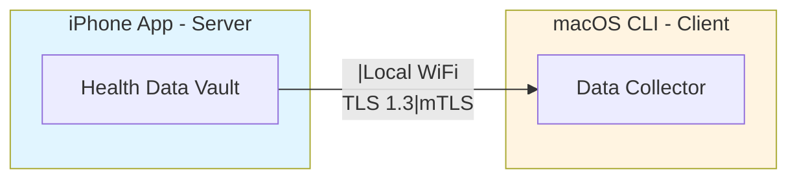
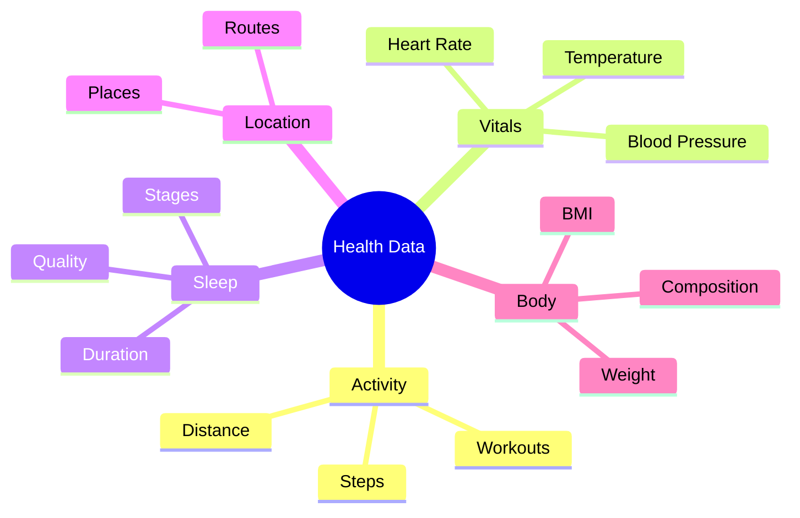
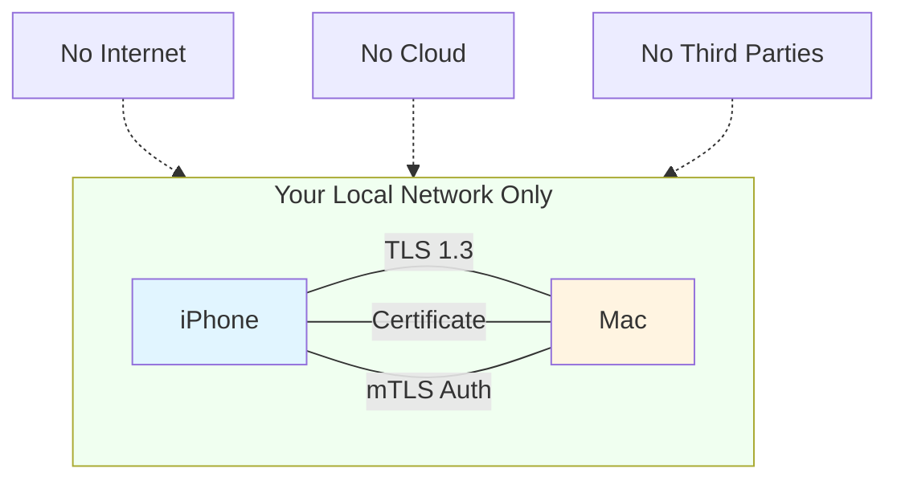
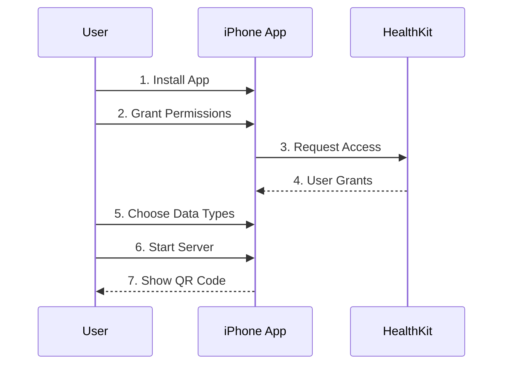
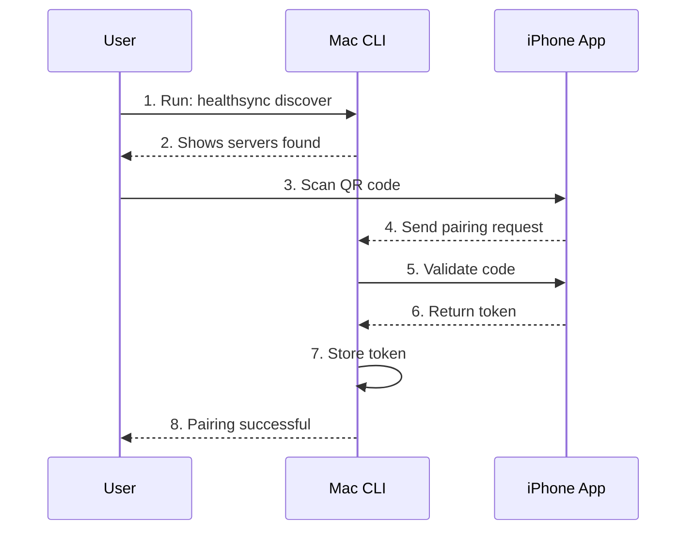
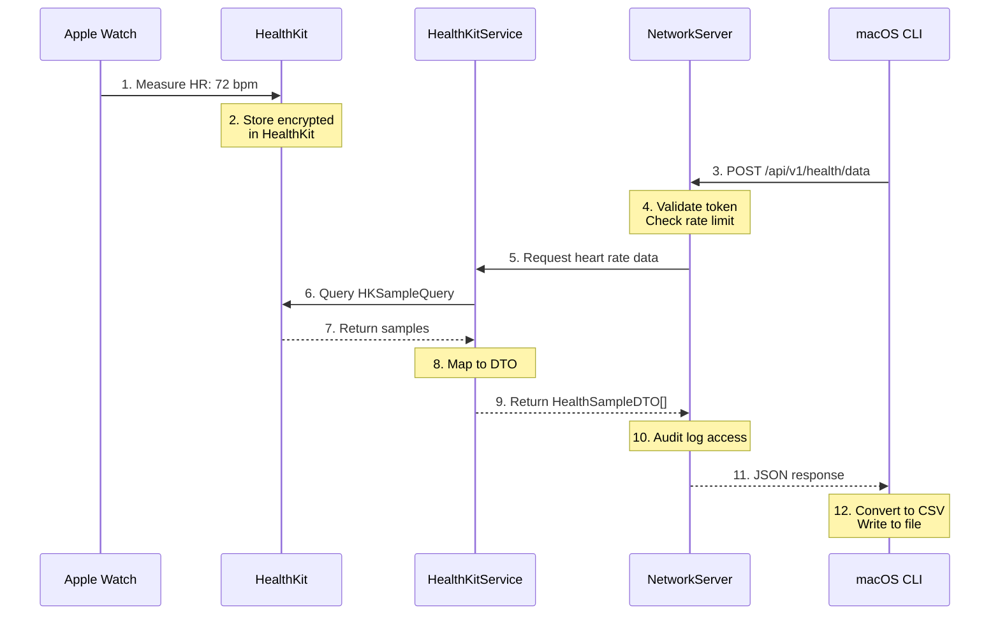
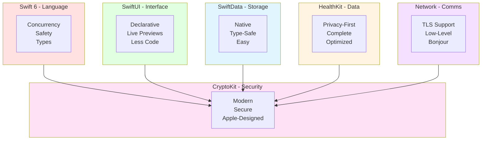

# Chapter 1: What This App Does & Why It Matters

**Understanding the Big Picture**

---

## 🎯 Learning Objectives

After this chapter, you will be able to:

- ✅ Explain what the iOS Health Sync App does in simple terms
- ✅ Understand the problem it solves
- ✅ Describe how the two apps work together
- ✅ Identify the main technologies involved

**Estimated Time:** 45 minutes

---

## 🧠 Pre-Chapter Check

Before we begin, ask yourself:

- **What do I already know** about iOS health apps and data transfer?
- **What confuses me** about health data privacy and security?
- **What do I hope to learn** from this chapter?

*Take 2 minutes to write down your answers. This primes your brain for learning.*

---

## The Simple Explanation

### What Is This App?

> **Analogy time:** Think of your health data like a diary you keep in a locked drawer. You want to share some pages with your computer, but you want to do it **securely** without sending your diary through the mail.

**This app solves that problem.**

The iOS Health Sync App lets you:
1. **Pair** your iPhone with your Mac (like Bluetooth pairing)
2. **Transfer** your health data directly (no cloud involved)
3. **Export** your data in useful formats (CSV for spreadsheets, JSON for developers)

### The Two-App System



**How it works:**
1. **iOS App** = The **server** - stores and serves your health data
2. **macOS App** = The **client** - requests and receives the data

They communicate over your **local WiFi network** — not the internet.

---

### 🔍 Stop & Think #1

**Before continuing, cover the text above and explain:**

- What problem does this app solve?
- What are the two main components?
- How do they communicate?

*Don't scroll down until you can explain it!*

---

## Why This Matters

### The Problem With Health Data

Health data is **personal** and **sensitive**. Consider what Apple Health tracks:



This data reveals patterns about your life that you might not want shared.

---

### Existing Solutions Have Problems

| Solution | Problem |
|----------|---------|
| **Cloud sync** | Data goes to servers you don't control |
| **Email export** | Insecure, unencrypted |
| **Screenshots** | Can't analyze the data |
| **No export** | Data locked on your phone |

### Our Solution: Local, Secure, Direct



**This gives you:**
- **Privacy** - data never leaves your local network
- **Security** - encrypted connection with certificate verification
- **Control** - you decide what to share and when
- **Ownership** - your data on your computer

---

### 🔍 Stop & Think #2

**Cover the text above. Explain:**

- Why is health data sensitive?
- What's wrong with cloud-based solutions?
- How does our approach protect your data?

*Explain it aloud in simple terms.*

---

## How It Works: The User Journey

### Step 1: Setup on iPhone



The app shows a QR code containing:
- Server IP address (e.g., `192.168.1.100`)
- Server port (e.g., `8443`)
- Certificate fingerprint (for security verification)

---

### Step 2: Pair with Mac



**The pairing creates a secure token that:**
- Valid for 30 days
- Can be revoked anytime
- Unique to each paired device

#### Clipboard Troubleshooting (Universal Clipboard)

If `healthsync scan` can't read the QR payload from clipboard:
- Ensure both devices are signed in to the same Apple ID
- Turn on Handoff on both devices (Settings > General > AirPlay & Handoff)
- Enable Wi-Fi and Bluetooth on both devices
- Keep devices near each other and unlocked
- Try copying again in the iOS app (tap Copy)
- Use `healthsync scan --debug-pasteboard` to see what macOS is receiving
- Fallback: take a Mac screenshot of the QR and run `healthsync scan --file ~/Desktop/qr.png`
- Note: iOS background execution is time-limited; sharing may pause after a short grace period when the app is backgrounded or the device locks.

---

### ✅ Quick Check: Section 1-2

Before continuing, check your understanding:

- [ ] I can explain the two-app architecture (iOS server + macOS client)
- [ ] I understand why local-only transfer matters for privacy
- [ ] I can describe the pairing process
- [ ] I know what information the QR code contains

**If any box is unchecked,** re-read the relevant section before continuing.

---

### Step 3: Fetch Data

```bash
# Fetch all health data as CSV
healthsync fetch --output my-health.csv

# Fetch specific date range
healthsync fetch --start 2024-01-01 --end 2024-12-31

# Fetch as JSON
healthsync fetch --format json --output my-health.json
```

### Step 4: Use Your Data

Now you can:
- Open in Excel/Numbers (CSV format)
- Analyze with Python/R (JSON format)
- Import into other apps
- Keep backups
- Share with your doctor

---

## 📊 I DO: Understanding the Data Flow

Let's trace a single health data point from iPhone to Mac. Follow along carefully:



**Total time:** < 1 second for 1000 samples

---

### 🔍 Stop & Think #3

**Cover the data flow diagram above. Explain:**

1. Where does the health data originate?
2. What does HealthKitService do?
3. How does the token protect the request?
4. What format does the client receive?

*Use your own words — no peeking!*

---

## The Technology Stack

### What We Use (And Why)



| Technology | Purpose | Why We Chose It |
|------------|---------|-----------------|
| **Swift 6** | Core language | Latest features, safety, performance |
| **SwiftUI** | User interface | Modern, declarative, efficient |
| **HealthKit** | Health data | Official Apple framework, secure |
| **SwiftData** | Data persistence | Native, type-safe, easy |
| **Network framework** | Server/Client | Low-level control, TLS support |
| **CryptoKit** | Cryptography | Modern, secure, Apple-designed |
| **os.Logger** | Logging | Structured, performant, privacy-aware |

---

## 📖 Real-World Use Cases

### Use Case 1: Personal Health Analysis

**🎯 Scenario:** You want to analyze your sleep patterns over the past year.


**Solution:**
```bash
healthsync fetch --types sleepAnalysis --start 2024-01-01 --output sleep.csv
```

Then analyze with Python:
```python
import pandas as pd
df = pd.read_csv('sleep.csv')
print(df['value'].describe())
```

### Use Case 2: Doctor Visit Preparation

**🎯 Scenario:** Your doctor wants to see your heart rate trends.

```bash
healthsync fetch --types heartRate --days 30 --format csv > heart-rate.csv
```

Bring the file on a USB drive (secure) or print it.

---

### 🧪 WE DO: Practice Together

Let's practice fetching specific data together.

**Task:** Fetch only heart rate and steps data from the last 7 days.

**Hint:** Think about which flags you need:
- `--types` specifies which data types
- `--days` specifies the date range

**Try it:**
```bash
# Your command here
```

**Solution:**
```bash
healthsync fetch --types heartRate,steps --days 7 --output weekly-data.csv
```

---

### 🚀 YOU DO: Independent Practice

**Task:** Fetch your sleep data from the past 90 days and export it as JSON for analysis.

*Write your command below before checking the solution.*

<details>
<summary>Click to see solution</summary>

```bash
healthsync fetch --types sleepAnalysis --days 90 --format json --output sleep-90days.json
```

**What if you only wanted REM sleep?** You'd use `--types sleepREM` instead.
</details>

---

## 🔍 Stop & Think #4

**Explain this to an imaginary 12-year-old:**

> "How does the health data get from my Apple Watch to my computer, and why is it safe?"

*Use simple analogies. If you stumble, review the data flow section.*

---

## Code Tour: Key Files

### App Entry Point

**File:** `App/iOS_Health_Sync_AppApp.swift`

```swift
@main
struct iOS_Health_Sync_AppApp: App {
    var sharedModelContainer: ModelContainer = {
        // 1. Define what data we'll store
        let schema = Schema([SyncConfiguration.self,
                            PairedDevice.self,
                            AuditEventRecord.self])

        // 2. Configure storage (not in memory)
        let modelConfiguration = ModelConfiguration(schema: schema,
                                                    isStoredInMemoryOnly: false)

        // 3. Create the container
        do {
            return try ModelContainer(for: schema,
                                      configurations: [modelConfiguration])
        } catch {
            fatalError("Could not create ModelContainer: \(error)")
        }
    }()

    var body: some Scene {
        WindowGroup {
            ContentView()
        }
        .modelContainer(sharedModelContainer)
    }
}
```

**Line-by-line breakdown:**
1. `@main` = App entry point (where execution begins)
2. `ModelContainer` = SwiftData's database connection
3. `Schema` = Defines our data models
4. `ModelConfiguration` = Storage settings
5. `.modelContainer()` = Makes data available to all views

---

### Central State Management

**File:** `App/AppState.swift:13-28`

```swift
@MainActor
@Observable
final class AppState {
    // Dependencies (injected for testability)
    private let modelContainer: ModelContainer
    private let healthService = HealthKitService()
    private let auditService: AuditService
    private let pairingService: PairingService
    private let networkServer: NetworkServer

    // Observable properties (auto-update UI)
    var syncConfiguration: SyncConfiguration
    var pairingQRCode: PairingQRCode?
    var isServerRunning: Bool = false
    var serverPort: Int = 0
    var serverFingerprint: String = ""
    var lastError: String?
    var protectedDataAvailable: Bool = true
    var healthAuthorizationStatus: Bool = false
```

**Key concepts:**
- `@MainActor` = All UI updates happen on main thread
- `@Observable` = Properties automatically trigger UI updates
- `final` = Cannot be subclassed (prevents inheritance issues)

---

### Health Data Types

**File:** `Core/Models/HealthDataType.swift:7-42`

```swift
enum HealthDataType: String, CaseIterable, Codable, Sendable, Identifiable {
    case steps
    case distanceWalkingRunning
    case heartRate
    // ... 35+ health data types

    var id: String { rawValue }

    var displayName: String {
        switch self {
        case .steps: return "Steps"
        case .heartRate: return "Heart Rate"
        // ...
        }
    }

    var sampleType: HKSampleType? {
        switch self {
        case .steps: return HKObjectType.quantityType(forIdentifier: .stepCount)
        case .heartRate: return HKObjectType.quantityType(forIdentifier: .heartRate)
        // ...
        }
    }
}
```

**Protocol conformance:**
- `CaseIterable` = Can iterate through all types
- `Codable` = Can encode/decode to JSON
- `Sendable` = Safe to pass across concurrent contexts
- `Identifiable` = Has unique ID for SwiftUI lists

---

### ✅ Quick Check: Code Tour

Check your understanding:

- [ ] I know where the app entry point is
- [ ] I understand what AppState does
- [ ] I can explain why HealthDataType is an enum
- [ ] I'm ready to move on

---

## 📝 Chapter Exercises

### 🟢 Beginner: Explain It Simply

**Task:** Explain the app to someone non-technical in 3 sentences.

**Example Answer:**
> "This app lets you securely copy health data from your iPhone to your Mac without using the internet. It works like a secure connection between your devices. You can then export your data to analyze in spreadsheets or other programs."

**Your Turn:** Write your 3-sentence explanation.

---

### 🟡 Intermediate: Data Flow Mapping

**Task:** Map the data flow for fetching steps data.

**Fill in the blanks:**

1. User runs `healthsync fetch --types steps`
2. CLI sends [BLANK] request to iOS server
3. Server validates [BLANK] from HTTP headers
4. Server checks if [BLANK] is enabled
5. HealthKitService queries [BLANK] framework
6. Results are mapped to [BLANK] objects
7. Response is sent as [BLANK] format
8. CLI converts data to [BLANK] file

**Answers:**
1. HTTPS POST /api/v1/health/data
2. Bearer token
3. steps (HealthDataType.steps)
4. HealthKit
5. HealthSampleDTO
6. JSON
7. CSV

---

### 🔴 Advanced: Security Analysis

**Task:** Answer these security questions by examining the codebase:

1. Why do we use TLS 1.3 instead of regular HTTPS?
2. What prevents unauthorized devices from connecting?
3. How does rate limiting protect against abuse?
4. Why are device names anonymized?

**Research the code to find your answers.**

---

## Common Pitfalls

### Pitfall 1: "This is just cloud sync"

**Wrong:** This app syncs to the cloud like iCloud.

**Right:** This app is **local only**. No internet, no cloud. Data goes directly between devices on your WiFi network.

### Pitfall 2: "HealthKit gives all data automatically"

**Wrong:** Once you grant permission, the app can access everything.

**Right:** Users must:
1. Explicitly grant permission (per data type)
2. Choose which types to enable for sharing
3. Can revoke access anytime in iOS Settings

### Pitfall 3: "The server is always running"

**Wrong:** The server runs continuously in the background.

**Right:** The server:
- Only runs when user starts it
- Stops when app goes to background
- Requires explicit user action to start

### Pitfall 4: "Pairing is permanent"

**Wrong:** Once paired, always paired.

**Right:** Pairing tokens:
- Expire after 30 days
- Can be revoked by user
- Are stored securely in Keychain

---

## 📝 Teach-Back Checkpoint

**Explain this chapter to:**

1. **A rubber duck** (seriously, it works)
2. **An imaginary 12-year-old**
3. **A non-technical friend**

**Cover these points:**
- What problem does the app solve?
- How does the two-app system work?
- Why is local-only transfer important?
- What happens during pairing?

**If you stumble**, review the relevant section. The Feynman Technique is about identifying gaps in your understanding.

---

## 📊 Quick Reference

### Key Concepts

| Concept | Summary |
|---------|---------|
| **Two-App System** | iOS server app + macOS CLI client |
| **Communication** | Local WiFi only, no internet |
| **Security** | TLS 1.3, mTLS, certificate-based auth |
| **Pairing** | QR code → token → 30-day access |
| **Data Flow** | HealthKit → Service → Network → Client |

### Technologies

| Tech | Purpose |
|------|---------|
| Swift 6 | Language (safety, concurrency) |
| SwiftUI | UI (declarative, efficient) |
| HealthKit | Health data (privacy-first) |
| SwiftData | Persistence (type-safe) |
| Network | Server/client (TLS support) |
| CryptoKit | Cryptography (modern) |

### Commands

```bash
# Discover servers
healthsync discover

# Scan QR code
healthsync scan

# Fetch data
healthsync fetch --types heartRate --days 30 --output data.csv

# Check status
healthsync status
```

---

## 📈 Spaced Repetition: Review Schedule

To cement this chapter in your long-term memory:

| When | What | Time |
|------|------|------|
| **Tomorrow** | Re-read Quick Reference, do Beginner exercise | 10 min |
| **In 3 days** | Review data flow diagram, explain aloud | 5 min |
| **In 1 week** | Do Intermediate exercise, Teach-Back | 20 min |
| **In 1 month** | Quick review before coding | 5 min |

> **Research:** Spaced repetition dramatically improves long-term retention — [XMind, 2025](https://xmind.com/blog/learning-strategies)

---

## 🎯 Chapter Completion Checklist

Before moving to Chapter 2, confirm:

- [ ] I explained this chapter to someone (or a rubber duck)
- [ ] I completed at least the Beginner exercise
- [ ] I can describe the two-app architecture
- [ ] I understand why local-only matters
- [ ] I know the main technologies used
- [ ] I've scheduled my first review (tomorrow)

**If any box is unchecked**, review the relevant section before proceeding.

---

## Coming Next

In **Chapter 2: Understanding The Architecture**, you'll learn:

- How the app is organized (layered architecture)
- The layered architecture pattern
- How services communicate
- Why we use dependency injection

**Prerequisite:** Make sure you're comfortable with this chapter's concepts before moving on!

---

## Further Reading

### HealthKit Documentation
- [HealthKit Overview](https://developer.apple.com/documentation/healthkit)
- [Designing a HealthKit App](https://developer.apple.com/documentation/healthkit/designing_a_healthkit_app)

### Network Programming
- [Network Framework](https://developer.apple.com/documentation/network)
- [TLS Overview](https://developer.apple.com/documentation/security/creating-a-secure-connection-using-tls)

### Privacy & Security
- [Apple Privacy Policy](https://www.apple.com/privacy/)
- [iOS Data Protection](https://support.apple.com/guide/iphone/data-protection-iph4bf6663c1/ios)

---

**Remember: Understanding the "why" is just as important as the "how". You now know both!**

**Next Chapter:** [Understanding The Architecture](02-architecture.md) →
