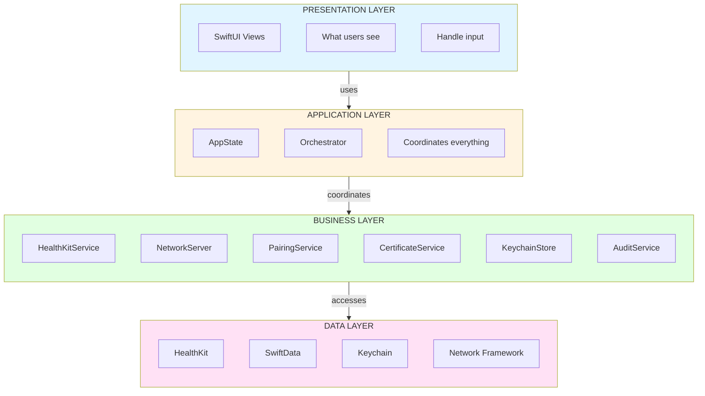
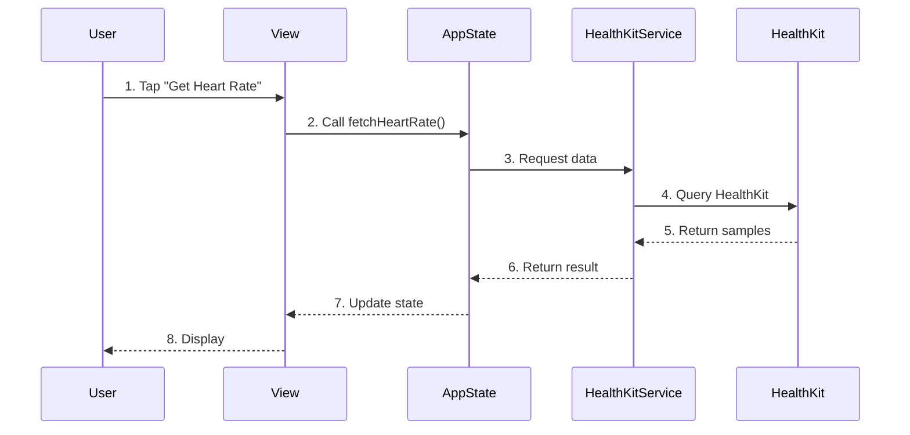
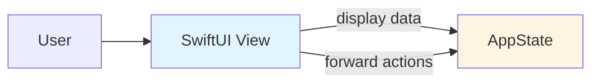
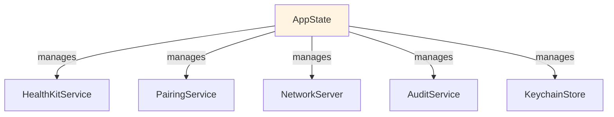
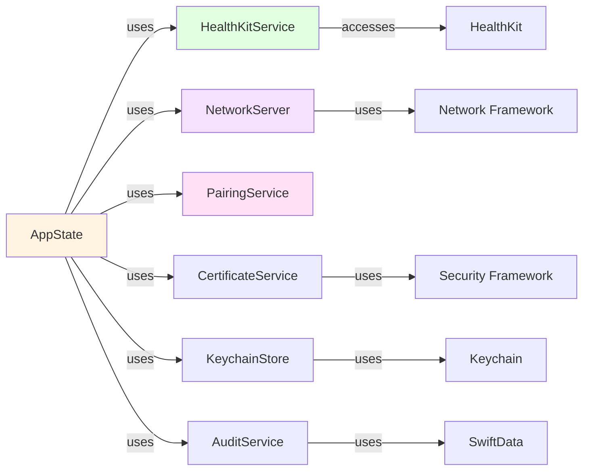
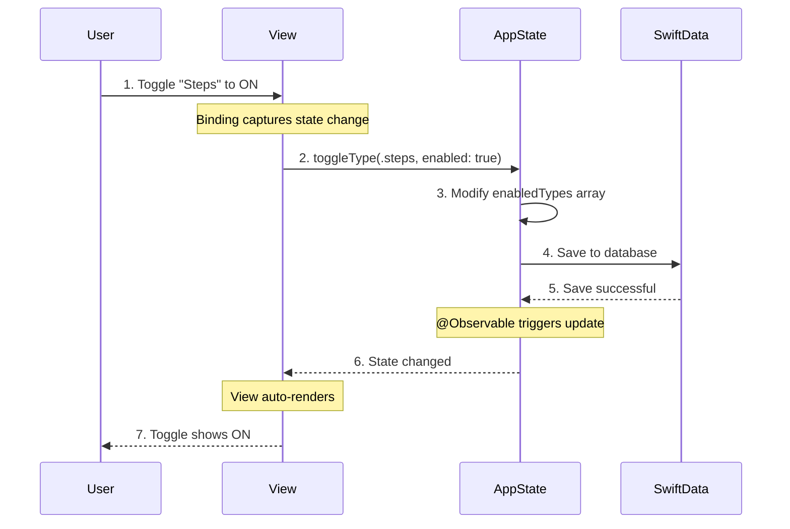
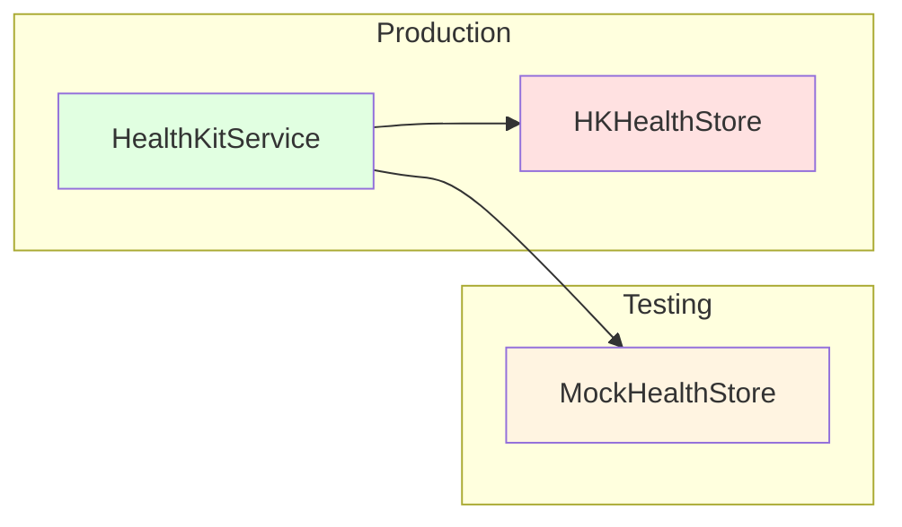
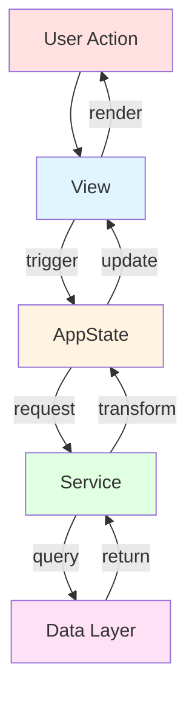
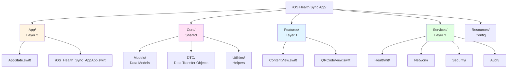

# Chapter 2: Understanding The Architecture

**How The App Is Organized**

---

## 🎯 Learning Objectives

After this chapter, you will be able to:

- ✅ Understand the layered architecture pattern
- ✅ Explain how services communicate
- ✅ Describe dependency injection
- ✅ Navigate the codebase efficiently

**Estimated Time:** 60 minutes

---

## 🧠 Pre-Chapter Check

Before we begin, ask yourself:

- **What do I already know** about software architecture?
- **What confuses me** about layered design or dependency injection?
- **What do I hope to learn** from this chapter?

*Take 2 minutes to write down your answers. This primes your brain for learning.*

---

## The Simple Explanation

### What Is Architecture?

> **Analogy time:** Think of architecture like organizing a kitchen.

**Bad architecture** is like a kitchen where:
- The fridge is in the bedroom
- Pots are scattered everywhere
- You can't find what you need when cooking

**Good architecture** is like a well-organized kitchen:
- Cooking tools near the stove
- Plates near the dining area
- Food grouped by category
- Everything has a logical place

**Good software architecture means:**
- **Easy to find** code you need
- **Easy to change** without breaking things
- **Easy to test** each part separately
- **Easy to understand** what each part does

---

### Our Architecture: Layered Design

We use **Layered Architecture** - like floors in a building. Let's visualize it:



**Key insight:** Each layer only talks to the layer below it. This keeps things organized and prevents tangled dependencies.

---

### 🔍 Stop & Think #1

**Before continuing, cover the architecture diagram above and explain:**

- What are the 4 layers and what does each do?
- Why doesn't the Presentation layer talk directly to the Data layer?
- What's the benefit of this organization?

*Don't scroll down until you can explain it!*

---

## Why Layered Architecture?

### The Problem: Spaghetti Code

Without architecture, code becomes "spaghetti" - everything tangled together.

> **Analogy:** Like having all your kitchen appliances plugged into one outlet—chaos!

Let's look at what bad architecture looks like:

```swift
// ❌ BAD: Spaghetti code
struct ContentView: View {
    var body: some View {
        Button("Get Heart Rate") {
            // View directly calling HealthKit - BAD!
            let store = HKHealthStore()
            let type = HKObjectType.quantityType(forIdentifier: .heartRate)!
            store.requestAuthorization(toShare: nil, read: [type]) { success, error in
                if success {
                    let query = HKSampleQuery(...) // Query in view - BAD!
                }
            }
        }
    }
}
```

**Problems:**
- ❌ Can't test without the UI
- ❌ Can't reuse logic elsewhere
- ❌ Hard to change implementation
- ❌ Everything depends on everything

---

### ✅ Quick Check: Spaghetti Code

Before continuing, check your understanding:

- [ ] I can explain why the code above is problematic
- [ ] I understand what "spaghetti code" means
- [ ] I can identify the architectural violations
- [ ] I'm ready to see the solution

**If any box is unchecked,** re-read the spaghetti code section.

---

### The Solution: Clean Layers

Here's the same functionality with proper architecture:



Now the code:

```swift
// ✅ GOOD: Layered architecture
struct ContentView: View {
    @Environment(\.appState) private var appState

    var body: some View {
        Button("Get Heart Rate") {
            // View just tells AppState what to do
            Task { await appState.fetchHeartRate() }
        }
    }
}

// AppState handles coordination
@MainActor
@Observable
class AppState {
    private let healthService: HealthKitService

    func fetchHeartRate() async {
        // HealthKitService handles the actual work
        let result = await healthService.fetchSamples(...)
    }
}

// HealthKitService knows about HealthKit
actor HealthKitService {
    func fetchSamples(...) async -> HealthDataResponse {
        // Actual HealthKit code here
    }
}
```

**Benefits:**
- ✅ Each layer has one job
- ✅ Can swap implementations easily
- ✅ Test without UI
- ✅ Reusable code

---

### 🔍 Stop & Think #2

**Cover the sequence diagram above. Explain:**

1. What happens when the user taps the button?
2. Which layer handles the coordination?
3. Which layer actually talks to HealthKit?
4. How does the view know to update?

*Explain the flow in your own words.*

---

## The Layers Explained

### Layer 1: Presentation (SwiftUI Views)



**Location:** `Features/` directory

**Job:** Show UI and handle user input

**Key Principle:** Views should be **dumb** - just display and forward actions

```swift
// File: Features/ContentView.swift
struct ContentView: View {
    @Environment(\.appState) private var appState

    var body: some View {
        List {
            // Display data from AppState
            ForEach(appState.syncConfiguration.enabledTypes) { type in
                Toggle(type.displayName, isOn: Binding(
                    get: { appState.isTypeEnabled(type) },
                    set: { enabled in
                        // Forward action to AppState
                        appState.toggleType(type, enabled: enabled)
                    }
                ))
            }
        }
    }
}
```

**What views DON'T do:**
- ❌ Call HealthKit directly
- ❌ Make network requests
- ❌ Access Keychain
- ❌ Business logic

**What views DO:**
- ✅ Display data
- ✅ Handle user input
- ✅ Trigger actions via AppState

---

### ✅ Quick Check: Presentation Layer

Check your understanding:

- [ ] Views are "dumb" - they just display and forward
- [ ] Views never call frameworks directly
- [ ] Views communicate only through AppState
- [ ] I'm ready to learn about AppState

---

### Layer 2: Application (AppState)



**Location:** `App/AppState.swift`

**Job:** Coordinate between views and services

**Key Principle:** AppState is the **orchestrator** - it doesn't do work, it coordinates

```swift
// File: App/AppState.swift:93-118
@MainActor
@Observable
final class AppState {
    // Services are dependencies (injected for testability)
    private let healthService = HealthKitService()
    private let auditService: AuditService
    private let pairingService: PairingService
    private let networkServer: NetworkServer

    func requestHealthAuthorization() async {
        do {
            guard await healthService.isAvailable() else {
                healthAuthorizationStatus = false
                lastError = "Health data is unavailable on this device."
                await auditService.record(eventType: "auth.healthkit",
                                          details: ["status": "unavailable"])
                return
            }

            // Delegate to healthService
            let dialogShown = try await healthService.requestAuthorization(
                for: syncConfiguration.enabledTypes
            )

            // Update UI state
            healthAuthorizationStatus = await healthService.hasRequestedAuthorization(
                for: syncConfiguration.enabledTypes
            )

            // Record for audit
            await auditService.record(eventType: "auth.healthkit", details: [
                "dialogShown": String(dialogShown),
                "requested": String(healthAuthorizationStatus)
            ])
        } catch {
            lastError = "HealthKit authorization failed: \(error.localizedDescription)"
        }
    }
}
```

**What AppState does:**
- ✅ Coordinate between services
- ✅ Manage UI state
- ✅ Handle errors
- ✅ Record audit events

**What AppState doesn't do:**
- ❌ Direct HealthKit queries
- ❌ Network implementation details
- ❌ Crypto operations

---

### 🔍 Stop & Think #3

**Cover the AppState code above. Explain:**

1. Why are services stored as private properties?
2. What does `@MainActor` ensure?
3. How does AppState coordinate between services?
4. Why is this better than putting logic in views?

*Think about the restaurant analogy from Chapter 1.*

---

### Layer 3: Business Logic (Services)



**Location:** `Services/` directory

**Job:** Implement core business logic

**Key Principle:** Services are **actors** - thread-safe, isolated units of work

```swift
// File: Services/HealthKit/HealthKitService.swift:12-34
actor HealthKitService {
    private let store: HealthStoreProtocol

    init(store: HealthStoreProtocol = HKHealthStore()) {
        self.store = store
    }

    func isAvailable() -> Bool {
        HKHealthStore.isHealthDataAvailable()
    }

    func requestAuthorization(for types: [HealthDataType]) async throws -> Bool {
        let readTypes = Set(await MainActor.run {
            types.compactMap { $0.sampleType }
        })
        return try await withCheckedThrowingContinuation { continuation in
            store.requestAuthorization(toShare: [], read: readTypes) {
                success, error in
                if let error {
                    continuation.resume(throwing: error)
                    return
                }
                continuation.resume(returning: success)
            }
        }
    }
}
```

**What services do:**
- ✅ Implement business logic
- ✅ Interact with frameworks (HealthKit, Network, Security)
- ✅ Transform data
- ✅ Handle framework-specific errors

**Key services:**
| Service | Responsibility |
|---------|----------------|
| `HealthKitService` | All HealthKit operations |
| `NetworkServer` | HTTP server implementation |
| `PairingService` | Device pairing logic |
| `CertificateService` | TLS certificate management |
| `KeychainStore` | Secure storage |
| `AuditService` | Security event logging |

---

### Layer 4: Data (Frameworks & Storage)

**Location:** Framework code and `Core/Models/`

**Job:** Store and retrieve data

**What lives here:**
- HealthKit framework calls
- SwiftData models and queries
- Keychain storage
- File system operations

```swift
// File: Core/Models/PersistenceModels.swift
@Model
final class SyncConfiguration {
    var enabledTypesCSV: String = HealthDataType.allCases
        .map(\.rawValue)
        .joined(separator: ",")
    var lastExportAt: Date?
    var createdAt: Date = Date()

    var enabledTypes: [HealthDataType] {
        get {
            enabledTypesCSV.split(separator: ",")
                .compactMap { HealthDataType(rawValue: String($0)) }
        }
        set {
            enabledTypesCSV = newValue.map(\.rawValue).joined(separator: ",")
        }
    }
}
```

---

## 📊 I DO: Understanding Communication Flow

Let's trace a simple action: User toggling "Steps" on.



**Total time:** < 100 milliseconds

---

### 🔍 Stop & Think #4

**Cover the sequence diagram above. Explain:**

1. What triggers the entire flow?
2. Which layer actually saves to the database?
3. How does the view know to update?
4. Why is this better than doing everything in the view?

*Explain it to an imaginary 12-year-old.*

---

## Dependency Injection

### What Is Dependency Injection?

> **Analogy:** Instead of buying your own ingredients, you're given exactly what you need.

**Dependency Injection (DI)** means: **Don't create your own dependencies - have them given to you.**

### 🧪 WE DO: Explore DI Together

Let's see the difference between tight coupling and dependency injection:

**Task:** Compare these two approaches

**Tightly Coupled (BAD):**
```swift
actor HealthKitService {
    private let store = HKHealthStore()  // ❌ Hard-coded!

    func fetchData() {
        // Can only use HKHealthStore - can't test with mock!
    }
}
```

**Loosely Coupled (GOOD):**
```swift
actor HealthKitService {
    private let store: HealthStoreProtocol  // ✅ Protocol!

    init(store: HealthStoreProtocol = HKHealthStore()) {
        self.store = store  // ✅ Injected!
    }

    func fetchData() {
        // Can use any HealthStoreProtocol implementation!
    }
}
```

**Why this matters:**



---

### 🚀 YOU DO: Practice DI

**Task:** Refactor this tightly coupled code to use dependency injection:

```swift
actor NetworkServer {
    private let pairingService = PairingService()  // Hard-coded!
    private let auditService = AuditService()      // Hard-coded!

    func start() {
        // ...
    }
}
```

*Write your solution before checking below.*

<details>
<summary>Click to see solution</summary>

```swift
actor NetworkServer {
    private let pairingService: PairingService
    private let auditService: AuditService

    init(
        pairingService: PairingService,
        auditService: AuditService
    ) {
        self.pairingService = pairingService
        self.auditService = auditService
    }

    func start() {
        // Now testable with mocks!
    }
}

// Usage:
let server = NetworkServer(
    pairingService: PairingService(modelContainer: container),
    auditService: AuditService(modelContainer: container)
)
```

**Benefits:**
- ✅ Testable with mocks
- ✅ Flexible implementation
- ✅ Clear dependencies
</details>

---

## Protocol-Oriented Design

We use **protocols** to define interfaces:

```swift
// File: Services/HealthKit/HealthStoreProtocol.swift
protocol HealthStoreProtocol {
    func requestAuthorization(
        toShare: Set<HKSampleType>?,
        read: Set<HKObjectType>?,
        completion: @escaping (Bool, Error?) -> Void
    )
    func authorizationStatus(for type: HKObjectType) -> HKAuthorizationStatus
    func getRequestStatusForAuthorization(
        toShare: Set<HKSampleType>?,
        read: Set<HKObjectType>?,
        completion: @escaping (HKAuthorizationRequestStatus, Error?) -> Void
    )
    func execute(_ query: HKQuery)
}
```

**Why protocols?**
- Define behavior, not implementation
- Enable mocking for tests
- Support multiple implementations
- Clear contracts between parts

---

## ✅ Quick Check: Dependency Injection

Check your understanding:

- [ ] I understand what dependency injection is
- [ ] I can explain why protocols matter for testing
- [ ] I can see how DI enables loose coupling
- [ ] I'm ready to learn about communication flow

---

## Communication Between Layers

### The Data Flow



---

## 📁 Directory Structure Deep Dive



**File Navigation Guide:**

| You want to... | Go to... |
|----------------|----------|
| See the main UI | `Features/ContentView.swift` |
| Change health data types | `Core/Models/HealthDataType.swift` |
| Understand data models | `Core/Models/PersistenceModels.swift` |
| See how HealthKit is used | `Services/HealthKit/HealthKitService.swift` |
| Understand the server | `Services/Network/NetworkServer.swift` |
| See security implementation | `Services/Security/` |
| Check audit logging | `Services/Audit/AuditService.swift` |
| View app state management | `App/AppState.swift` |

---

## Actor Concurrency Model

### What Are Actors?

**Actors** are Swift's way to make data **thread-safe**. Think of an actor as a bodyguard protecting data:

```mermaid
sequenceDiagram
    participant T1 as Task A
    participant T2 as Task B
    participant Actor as Actor Service
    participant D as Protected Data

    T1->>Actor: 1. Call method()
    Note over Actor: Task A enters
    Actor->>D: 2. Access data
    Actor-->>T1: 3. Return result
    Note over Actor: Task A leaves

    T2->>Actor: 4. Call method (while A is running)
    Note over Actor: Task B WAITS
    Actor->>D: 5. Access data
    Actor-->>T2: 6. Return result
```

**Why actors matter:**
- Prevents data races (two threads writing at once)
- Ensures data consistency
- No locks or semaphores needed
- Compiler enforces safety

### Actor Example

```swift
// File: Services/HealthKit/HealthKitService.swift:12
actor HealthKitService {
    private let store: HealthStoreProtocol

    // All methods are async and serialized
    func fetchSamples(...) async -> HealthDataResponse {
        // Only one fetchSamples runs at a time
        // Data is guaranteed to be consistent
    }

    func requestAuthorization(...) async throws -> Bool {
        // Waits for any running method to finish
        // Then runs safely
    }
}
```

**What happens:**
1. Task A calls `fetchSamples`
2. Task B calls `fetchSamples` at the same time
3. Task B **waits** until Task A finishes
4. No data corruption possible

---

### @MainActor for UI

```swift
// File: App/AppState.swift:13
@MainActor
@Observable
final class AppState {
    // All properties must be accessed on main thread
    var isServerRunning: Bool = false
    var serverPort: Int = 0
}
```

`@MainActor` ensures:
- All UI updates happen on main thread
- Properties can only be accessed on main thread
- Compiler enforces this safety

---

## 📝 Chapter Exercises

### 🟢 Beginner: Layer Identification

**Task:** Match code to its layer

**Code snippets:**
```swift
A) struct ContentView: View { ... }
B) actor HealthKitService { ... }
C) @Model final class SyncConfiguration { ... }
D) @MainActor @Observable final class AppState { ... }
```

**Layers:**
1. Presentation Layer
2. Application Layer
3. Business Logic Layer
4. Data Layer

**Match:** A→1, B→3, C→4, D→2

---

### 🟡 Intermediate: Draw the Architecture

**Task:** Draw the layered architecture diagram from memory

Include:
- All 4 layers
- What each layer does
- How data flows between them

**Compare with this chapter's diagram.**

---

### 🔴 Advanced: Identify Violations

**Task:** Find architecture violations in this code:

```swift
struct BadView: View {
    var body: some View {
        Button("Fetch Data") {
            let store = HKHealthStore()
            let type = HKObjectType.quantityType(forIdentifier: .heartRate)!
            store.requestAuthorization(toShare: nil, read: [type]) { _, _ in }
        }
    }
}
```

**Violations:**
1. View directly accessing HealthKit (should use AppState)
2. Creating HKHealthStore in view (should be injected)
3. Not using async/await properly
4. No error handling

**Fix it!** Create the layered version.

---

## Common Pitfalls

### Pitfall 1: "Fat View Controllers"

**Wrong:** Put everything in the view

**Right:** View is just presentation

### Pitfall 2: Skipping Layers

**Wrong:** View talks directly to data layer

**Right:** Go through AppState and Services

### Pitfall 3: God Object

**Wrong:** One service does everything

**Right:** Separate concerns

---

## 📝 Teach-Back Checkpoint

**Explain this chapter to:**

1. **A rubber duck** (seriously, it works)
2. **An imaginary 12-year-old**
3. **A non-technical friend**

**Cover these points:**
- What are the 4 layers and what does each do?
- Why is layered architecture important?
- How does dependency injection help?
- What are actors and why do we need them?

**If you stumble**, review the relevant section. The Feynman Technique is about identifying gaps in your understanding.

---

## 📊 Quick Reference

### Architecture Principles

| Principle | Description | Example |
|-----------|-------------|---------|
| **Separation of Concerns** | Each layer has one job | Views don't call HealthKit |
| **Dependency Injection** | Pass dependencies in | `HealthKitService(store:)` |
| **Protocol-Oriented** | Define interfaces, not implementations | `HealthStoreProtocol` |
| **Actor Isolation** | Thread-safe operations | All services are actors |
| **Single Responsibility** | Each class does one thing | `PairingService` only pairs |

### Layer Responsibilities

| Layer | Responsibility | Example |
|-------|---------------|---------|
| **Presentation** | Display and forward | SwiftUI Views |
| **Application** | Coordinate | AppState |
| **Business** | Core logic | Services |
| **Data** | Store/retrieve | HealthKit, SwiftData |

### Code Patterns

| Pattern | Description | When to Use |
|---------|-------------|-------------|
| `@MainActor` | UI thread guarantee | AppState |
| `actor` | Thread safety | Services |
| `protocol` | Testable interface | All dependencies |
| `@Observable` | State observation | UI state |

---

## 📈 Spaced Repetition: Review Schedule

To cement this chapter in your long-term memory:

| When | What | Time |
|------|------|------|
| **Tomorrow** | Re-read Quick Reference, do Beginner exercise | 10 min |
| **In 3 days** | Draw architecture diagram from memory, explain aloud | 10 min |
| **In 1 week** | Do Intermediate exercise, Teach-Back to rubber duck | 25 min |
| **In 1 month** | Quick review before refactoring any code | 5 min |

---

## 🎯 Chapter Completion Checklist

Before moving to Chapter 3, confirm:

- [ ] I explained layered architecture to someone (or a rubber duck)
- [ ] I completed at least the Beginner exercise
- [ ] I can draw the 4-layer architecture from memory
- [ ] I understand why dependency injection matters
- [ ] I know what actors are and when to use them
- [ ] I've scheduled my first review (tomorrow)

**If any box is unchecked**, review the relevant section before proceeding.

---

## Coming Next

In **Chapter 3: Swift 6 - The Foundation**, you'll learn:

- Swift 6 concurrency (async/await)
- Actor isolation
- Sendable types
- Modern Swift patterns

**Prerequisite:** Make sure you're comfortable with this chapter's concepts before moving on! Understanding architecture is foundational.

---

## Further Reading

### Architecture Patterns
- [Clean Architecture by Robert C. Martin](https://blog.cleancoder.com/uncle-bob/2012/08/13/the-clean-architecture.html)
- [SwiftUI Architecture: MVVM vs. Clean Architecture](https://www.createwithswift.com/swiftui-architecture-patterns/)

### Swift Concurrency
- [Swift Concurrency Manifesto](https://github.com/apple/swift-evolution/blob/main/proposals/0106-objc-async-concurrency.md)
- [Meet async/await in Swift](https://developer.apple.com/videos/play/wwdc2021/10132/)

---

**Remember: Good architecture is like good organization - everything has its place. You now know how to structure iOS apps for maximum maintainability!**

**Next Chapter:** [Swift 6 - The Foundation](03-swift6.md) →
