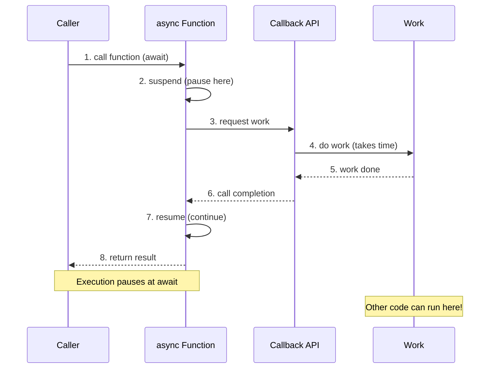
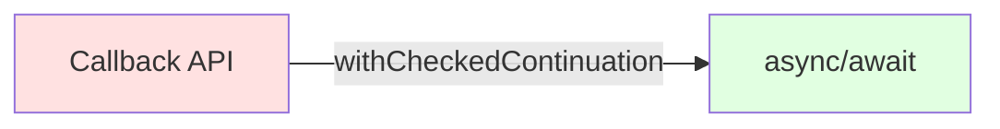
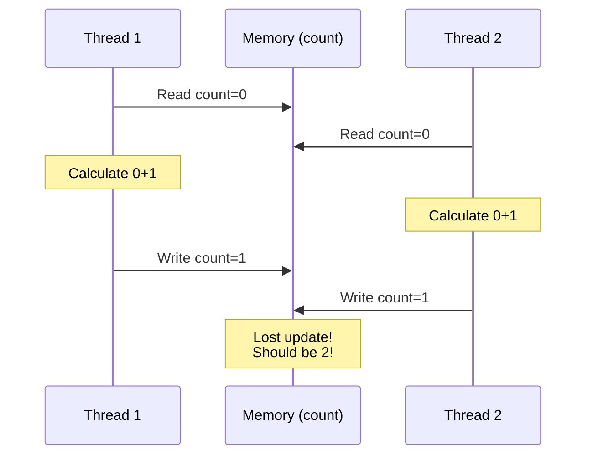
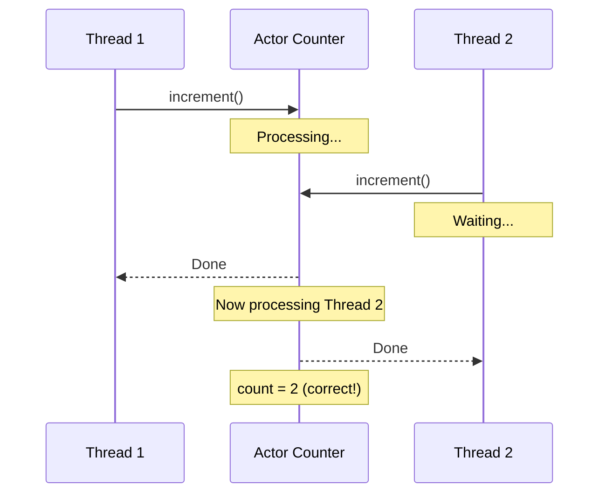
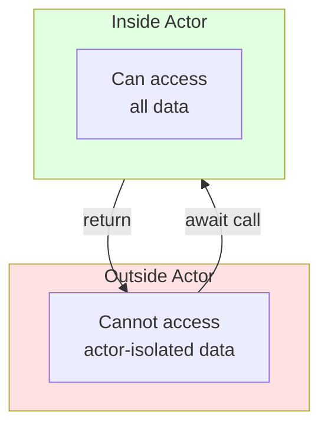
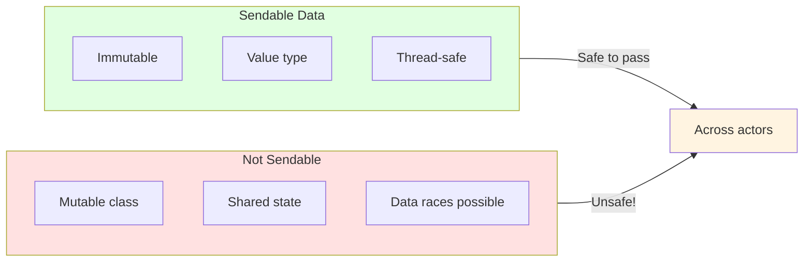
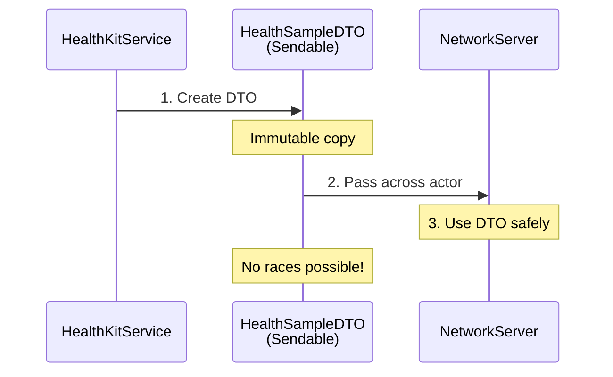
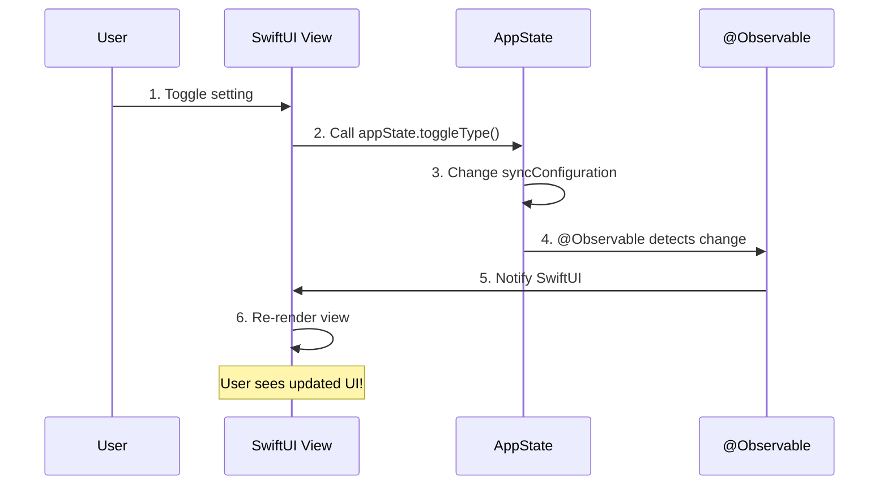
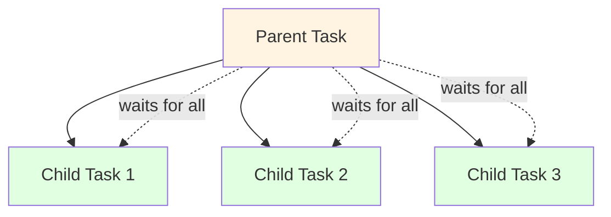
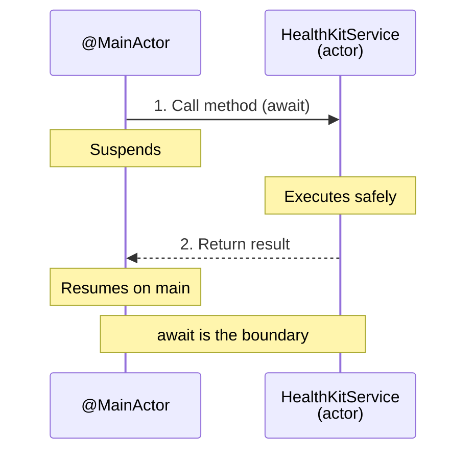

# Chapter 3: Swift 6 - The Foundation

**Modern Swift Patterns for Safe Concurrent Code**

---

## 🎯 Learning Objectives

After this chapter, you will be able to:

- ✅ Explain how async/await simplifies asynchronous code
- ✅ Use actors to prevent data races
- ✅ Identify and create Sendable types
- ✅ Apply @Observable for automatic state management
- ✅ Write safe concurrent code with Swift 6 patterns

**Estimated Time:** 75 minutes

---

## 🧠 Pre-Chapter Check

Before we begin, ask yourself:

- **What do I already know** about concurrency (doing multiple things at once)?
- **What confuses me** about async/await or threads?
- **What do I hope to learn** from this chapter?

*Take 2 minutes to write down your answers. This primes your brain for learning.*

---

## Section 1: Understanding Concurrency

### What Is Concurrency?

**Concurrency** means doing multiple things at once. Think of a kitchen:

> **Analogy time:** A kitchen with one chef vs. a kitchen with a chef and assistants.

**Single-threaded (old way):**
```
Chef chops onions
  THEN
Chef boils water
  THEN
Chef cooks pasta
  THEN
Chef makes sauce
```
One thing at a time. Slow and inefficient.

**Concurrent (new way):**
```
Chef chops onions      →     Assistant boils water
Chef cooks pasta       →     Assistant prepares sauce
All at the same time!
```
Multiple things happening at once. Fast and efficient.

**Key points:**
- **Concurrency** ≠ Parallelism (concurrency is about structure, parallelism is about execution)
- Swift 6 gives us tools to do concurrency **safely**
- No more crashes from data races!

### The Swift 6 Concurrency Toolkit

```mermaid
graph LR
    A[Swift 6 Concurrency]

    A --> B[async/await]
    A --> C[actors]
    A --> D[Sendable]
    A --> E[@Observable]
    A --> F[@MainActor]

    B --> B1[Write async code linearly]
    C --> C1[Thread-safe isolation]
    D --> D1[Safe data sharing]
    E --> E1[Automatic state updates]
    F --> F1[UI thread safety]

    style A fill:#e1f5ff
    style B fill:#fff4e1
    style C fill:#e1ffe1
    style D fill:#ffe1f5
    style E fill:#f5e1ff
    style F fill:#ffe1e1
```

| Tool | Purpose | When to Use |
|------|---------|-------------|
| `async/await` | Write async code like sync code | Network/disk I/O |
| `actors` | Protect data from races | Mutable shared state |
| `Sendable` | Mark safe-to-share data | Across actors |
| `@Observable` | Automatic state observation | SwiftUI state |
| `@MainActor` | UI thread safety | UI updates |

### 🔍 Stop & Think #1

**Before continuing, cover the text above and explain:**

1. What's the difference between concurrency and parallelism?
2. Why do we need special tools for concurrency?
3. What problems can occur without these tools?

*Don't scroll down until you can explain it!*

---

### ✅ Quick Check: Concurrency Basics

Check your understanding:

- [ ] I can explain what concurrency means
- [ ] I understand why we need Swift 6's concurrency tools
- [ ] I know the 5 main tools in Swift 6's concurrency toolkit
- [ ] I'm ready to learn about async/await

**If any box is unchecked,** re-read the section above before continuing.

---

## Section 2: Async/Await - Writing Clean Asynchronous Code

### The Problem: Callback Hell

Before Swift 5.5, we used **completion handlers**:

```swift
// OLD WAY: Completion handlers (messy!)
func fetchHeartRate(completion: @escaping (Double?, Error?) -> Void) {
    healthStore.execute(query) { samples, error in
        if let error {
            completion(nil, error)
            return
        }

        let heartRates = samples?.compactMap { sample -> Double? in
            guard let sample = sample as? HKQuantitySample else { return nil }
            return sample.quantity.doubleValue(for: unit)
        }

        completion(heartRates.first, nil)
    }
}

// Using it - notice the nesting!
fetchHeartRate { heartRate, error in
    if let error {
        print("Error: \(error)")
        return
    }

    if let heartRate {
        print("Heart rate: \(heartRate)")
        // Nested callbacks...
        self.saveHeartRate(heartRate) { success in
            if success {
                self.updateUI { // More nesting!
                    // 😰 This is callback hell!
                }
            }
        }
    }
}
```

**Problems:**
- Nested code is hard to read (the "pyramid of doom")
- Error handling is repetitive
- Control flow is unclear
- Easy to miss errors

### The Solution: async/await

**File:** `Services/HealthKit/HealthKitService.swift:23-41`

```swift
// NEW WAY: Clean and readable
func requestAuthorization(for types: [HealthDataType]) async throws -> Bool {
    let readTypes = Set(await MainActor.run { types.compactMap { $0.sampleType } })

    // withCheckedThrowingContinuation bridges callback to async/await
    return try await withCheckedThrowingContinuation { continuation in
        store.requestAuthorization(toShare: [], read: readTypes) { success, error in
            if let error {
                continuation.resume(throwing: error)
                return
            }
            continuation.resume(returning: success)
        }
    }
}

// Using it - linear and clear!
do {
    let success = try await requestAuthorization(for: [.steps])
    if success {
        let samples = try await fetchSamples(...)  // No nesting!
        await updateUI()  // Easy to read!
    }
} catch {
    print("Error: \(error)")
}
```

### How async/await Works



**What's happening:**
1. `async` - This function can suspend (pause)
2. `await` - Pause here until result is ready
3. `throws` - This function can error
4. While suspended, other code can run (efficient!)
5. When result is ready, execution continues

### Bridging Callbacks to async/await

HealthKit uses callbacks. We bridge them:



**The bridge pattern:**

```swift
// Callback-based (HealthKit API)
store.requestAuthorization(...) { success, error in
    // Callback
}

// We bridge to async/await
return try await withCheckedThrowingContinuation { continuation in
    store.requestAuthorization(...) { success, error in
        if let error {
            continuation.resume(throwing: error)
        } else {
            continuation.resume(returning: success)
        }
    }
}
```

**Key points:**
- `withCheckedThrowingContinuation` - Bridges callback to async/await
- `continuation.resume(returning:)` - Return success
- `continuation.resume(throwing:)` - Return error
- Only call resume **once**!

### 📊 I DO: Converting Callbacks to async/await

Let's convert a callback-based function together.

**Callback version:**
```swift
func fetchData(completion: @escaping (Data?, Error?) -> Void) {
    urlSession.dataTask(with: url) { data, _, error in
        completion(data, error)
    }.resume()
}
```

**Step-by-step conversion:**

1. **Mark function as `async throws`:**
```swift
func fetchData() async throws -> Data {
    // Remove completion parameter
```

2. **Use `withCheckedThrowingContinuation`:**
```swift
func fetchData() async throws -> Data {
    return try await withCheckedThrowingContinuation { continuation in
        // Callback code goes here
    }
}
```

3. **Move callback logic and call resume:**
```swift
func fetchData() async throws -> Data {
    return try await withCheckedThrowingContinuation { continuation in
        urlSession.dataTask(with: url) { data, _, error in
            if let error {
                continuation.resume(throwing: error)
            } else {
                continuation.resume(returning: data ?? Data())
            }
        }.resume()
    }
}
```

**Key insight:** We're wrapping the callback in a continuation, then resuming with the result.

### 🔍 Stop & Think #2

**Cover the [diagram/code] above. Explain:**

1. What does `await` do to execution?
2. Why do we need `withCheckedThrowingContinuation`?
3. What happens if you call `resume` twice?

*Use your own words — no peeking!*

---

### ✅ Quick Check: Async/Await

Check your understanding:

- [ ] I understand what async/await does
- [ ] I can explain the execution flow with await
- [ ] I know how to bridge callbacks to async/await
- [ ] I'm ready to learn about actors

**If any box is unchecked,** re-read the section above before continuing.

---

## Section 3: Actors - Thread Safety Made Simple

### The Problem: Data Races

A **data race** happens when two threads access data simultaneously without coordination.

```swift
// UNSAFE: Data race possible!
class Counter {
    var count = 0

    func increment() {
        count = count + 1  // ❌ What if another thread reads count here?
    }
}
```

**Visualizing the data race:**



**What happened:**
1. Both threads read `count = 0`
2. Both calculate `0 + 1 = 1`
3. Both write `count = 1`
4. Result: `count = 1` instead of `2`!
5. **This is a data race** - undefined behavior!

### The Solution: Actors

**Actors** protect data by serializing access:

```swift
// SAFE: Actor prevents races
actor Counter {
    var count = 0

    func increment() {
        count = count + 1  // ✅ Only one thread at a time!
    }
}
```

**How actors work:**



**Key points:**
- Only one task can execute inside actor at a time
- Other tasks wait their turn (queue)
- Data is always consistent
- Compiler enforces safety

### Actor Isolation

Actors have **isolation** - their data is protected:

```swift
actor BankAccount {
    private var balance: Double = 0.0

    func deposit(amount: Double) {
        balance += amount  // ✅ Can access from inside
    }

    func getBalance() -> Double {
        return balance  // ✅ Can access from inside
    }
}

// Outside actor
let account = BankAccount()
// print(account.balance)  // ❌ ERROR: Can't access actor-isolated property
let bal = await account.getBalance()  // ✅ Must call method
```

**Visualizing actor isolation:**



### In Our Code: All Services Are Actors

**File:** `Services/HealthKit/HealthKitService.swift:12`

```swift
actor HealthKitService {
    private let store: HealthStoreProtocol

    func fetchSamples(...) async -> HealthDataResponse {
        // Guaranteed to not overlap with other calls
        // Data is safe!
    }
}
```

**File:** `Services/Network/NetworkServer.swift:11`

```swift
actor NetworkServer {
    private var requestLog: [String: [Date]] = [:]

    func route(...) async -> HTTPResponse {
        // Only one request routed at a time
        // requestLog is safe!
    }
}
```

**File:** `Services/Security/PairingService.swift:11`

```swift
actor PairingService {
    private var storedTokens: [String: PairingToken] = [:]

    func validateToken(...) async -> Bool {
        // Token storage is safe from races
    }
}
```

**Why all services are actors:**
- Services hold state (data)
- Multiple calls can happen simultaneously
- Actors prevent corruption
- No locks needed (compiler handles it!)

### 🧪 WE DO: Explore Actor Isolation

Let's practice with actor isolation together.

**Task:** Fix this code to use actors properly.

```swift
// BROKEN: Fix this!
class UserService {
    var users: [String: String] = [:]

    func addUser(name: String, email: String) {
        users[name] = email
    }

    func getEmail(for name: String) -> String? {
        return users[name]
    }
}

// Usage
let service = UserService()
service.addUser(name: "Alice", email: "alice@example.com")
let email = service.getEmail(for: "Alice")  // Not thread-safe!
```

**Hint:** Think about:
1. What keyword makes this a thread-safe actor?
2. Do we need to add `async`/`await` anywhere?

**Try it:**
```swift
// Your code here
```

**Solution:**
```swift
// FIXED: Thread-safe with actor
actor UserService {
    var users: [String: String] = [:]

    func addUser(name: String, email: String) {
        users[name] = email
    }

    func getEmail(for name: String) -> String? {
        return users[name]
    }
}

// Usage - notice the await!
let service = UserService()
await service.addUser(name: "Alice", email: "alice@example.com")
let email = await service.getEmail(for: "Alice")  // Thread-safe!
```

**What's happening:**
- Changed `class` to `actor` - now thread-safe!
- All method calls need `await` - serializes access
- Data is protected from races automatically

### 🔍 Stop & Think #3

**Cover the code above. Explain:**

1. Why did we need to change `class` to `actor`?
2. Why do we now need `await` to call methods?
3. What would happen if two threads called `addUser` simultaneously?

*Use your own words — no peeking!*

---

### ✅ Quick Check: Actors

Check your understanding:

- [ ] I understand what data races are
- [ ] I know how actors prevent data races
- [ ] I can explain actor isolation
- [ ] I'm ready to learn about Sendable

**If any box is unchecked,** re-read the section above before continuing.

---

## Section 4: Sendable - Safe Data Sharing

### What Is Sendable?

**Sendable** means data is safe to pass between concurrent contexts.

> **Analogy time:** Passing notes in class vs. sharing a whiteboard.

```
SAFE (Sendable):                  UNSAFE (not Sendable):
A piece of paper                  A shared whiteboard
Content doesn't change            Multiple people writing at once
Copy is independent               Original changes affect everyone
```

**Visualizing Sendable vs. non-Sendable:**



### Sendable Types

These types are automatically Sendable:

```swift
// Value types (copied when passed)
Int, Double, Bool, String        ✅ Sendable
struct Point { x, y }            ✅ Sendable

// Immutable collections
let array = [1, 2, 3]            ✅ Sendable
let dict = ["key": "value"]      ✅ Sendable

// Actors (protected by isolation)
actor MyService { }              ✅ Sendable

// Classes with @MainActor
@MainActor class AppState { }    ✅ Sendable
```

### Marking Your Types as Sendable

```swift
// Safe to send (all properties are immutable)
struct HealthSampleDTO: Sendable {
    let id: UUID
    let value: Double
    // All properties are 'let' (immutable)
}

// Safe actor
actor HealthKitService: Sendable {
    // Actors are always Sendable
}

// Unsafe class (not Sendable by default)
class MyData {
    var mutable: String = ""  // ❌ Not Sendable!
}

// Make it Sendable (you guarantee safety!)
final class MyData: @unchecked Sendable {
    // ⚠️ You must ensure thread safety yourself!
    private let lock = NSLock()
    var mutable: String {
        get { lock.lock(); defer { lock.unlock() }; return mutable }
        set { lock.lock(); defer { lock.unlock() }; mutable = newValue }
    }
}
```

### In Our Code: HealthSampleDTO

**File:** `Core/DTO/HealthSampleDTO.swift`

```swift
struct HealthSampleDTO: Codable, Sendable {
    let id: UUID
    let type: String
    let value: Double
    let unit: String
    let startDate: Date
    let endDate: Date
    let sourceName: String
    let metadata: [String: String]?

    // All properties are 'let' (immutable)
    // Safe to pass between concurrent contexts
}
```

**Why Sendable matters:**
- We pass DTOs between actor services
- Compiler ensures no data races
- Safe to send across `await` boundaries

**Data flow with Sendable:**



### 🚀 YOU DO: Practice Sendable

**Task:** Create a Sendable type for a network request.

*Write your code below before checking the solution.*

<details>
<summary>Click to see solution</summary>

```swift
// Sendable network request
struct NetworkRequest: Sendable {
    let url: String
    let method: String
    let body: Data?
    let headers: [String: String]

    // All 'let' = immutable = Sendable
}

// Alternative: Use enum for method (type-safe)
struct NetworkRequest: Sendable {
    enum Method: String, Sendable {
        case get, post, put, delete
    }

    let url: String
    let method: Method
    let body: Data?
    let headers: [String: String]
}
```

**Explanation:**
- All properties use `let` (immutable)
- Value types (String, Data, Array) are copied when passed
- No mutable state = no data races possible
- Compiler confirms it's safe to share across actors

**Bonus:** Add a computed property:

```swift
extension NetworkRequest {
    var isValid: Bool {
        !url.isEmpty && !method.isEmpty
    }
}
```
</details>

---

## Section 5: @Observable - Automatic State Updates

### What Is @Observable?

**@Observable** makes your properties automatically notify observers when they change.

> **Analogy time:** Subscribing to a YouTube channel.

```
You subscribe to a YouTube channel
  ↓
Channel uploads new video
  ↓
YouTube notifies you
  ↓
You watch the video
```

**@Observable works the same:**
```swift
@Observable class AppState {
    var isServerRunning: Bool = false
}

// SwiftUI subscribes automatically
// When isServerRunning changes, view updates!
```

**How @Observable works:**

```mermaid
graph LR
    A[Code changes property] --> B[@Observable tracks change]
    B --> C[Observers notified]
    C --> D[SwiftUI re-renders]

    style A fill:#fff4e1
    style B fill:#e1ffe1
    style C fill:#f5e1ff
    style D fill:#ffe1e1
```

### The Old Way vs. New Way

**Old: ObservableObject + @Published**

```swift
// OLD WAY
class AppState: ObservableObject {
    @Published var isServerRunning: Bool = false
    @Published var serverPort: Int = 0
}

struct ContentView: View {
    @StateObject private var appState = AppState()

    var body: some View {
        Text("Port: \(appState.serverPort)")
        // Manually accessing @Published properties
    }
}
```

**Problems:**
- Need `@Published` on every property
- More boilerplate code
- `@StateObject` vs `@ObservedObject` confusion
- Slower performance

**New: @Observable**

```swift
// NEW WAY
@Observable class AppState {
    var isServerRunning: Bool = false
    var serverPort: Int = 0
    // No @Published needed!
}

struct ContentView: View {
    @Environment(\.appState) private var appState

    var body: some View {
        Text("Port: \(appState.serverPort)")
        // All properties automatically observable!
    }
}
```

**Benefits:**
- Less boilerplate (no `@Published`)
- Better performance
- Easier to use
- Automatic tracking

### In Our Code: AppState

**File:** `App/AppState.swift:13-28`

```swift
@MainActor
@Observable
final class AppState {
    // All these properties automatically notify observers!
    var syncConfiguration: SyncConfiguration
    var pairingQRCode: PairingQRCode?
    var isServerRunning: Bool = false
    var serverPort: Int = 0
    var serverFingerprint: String = ""
    var lastError: String?
    var protectedDataAvailable: Bool = true
    var healthAuthorizationStatus: Bool = false
}
```

**The update flow:**



**What happens:**
1. User toggles a setting in the UI
2. View calls `appState.toggleType()`
3. `syncConfiguration` property changes
4. @Observable automatically detects the change
5. SwiftUI is notified
6. View re-renders with new data

**No manual notification needed!**

### @MainActor + @Observable

```swift
@MainActor
@Observable
final class AppState {
    var isServerRunning: Bool = false
}
```

**Why both?**
- `@MainActor` - Ensures all code runs on UI thread
- `@Observable` - Automatically tracks property changes
- Together - Perfect for SwiftUI state management!

---

## Section 6: Advanced Patterns

### Structured Concurrency

**Structured concurrency** means async tasks have a clear hierarchy:



**Key points:**
- Parent waits for all children
- Children are cancelled if parent is cancelled
- Clear ownership and cleanup

### Crossing Actor Boundaries



**Example:**
```swift
@MainActor class AppState {
    private let healthService: HealthKitService  // different actor

    func fetchData() async {
        // Crossing from @MainActor to HealthKitService actor
        let result = await healthService.fetchSamples(...)
        // Back on @MainActor
    }
}
```

**The `await` is the boundary:**
- Before `await` = on @MainActor
- During `await` = on HealthKitService actor
- After `await` = back on @MainActor

### Task Cancellation

```swift
func fetchSamples(...) async -> HealthDataResponse {
    for type in types {
        // Check for cancellation
        try Task.checkCancellation()

        let samples = await querySamples(for: type, ...)
        collected.append(contentsOf: samples)
    }
}
```

**Why this matters:**
- User navigates away → Task cancelled
- Resources cleaned up → No wasted work
- Graceful shutdown → Better UX

---

## 📊 Quick Reference

### Key Concepts

| Concept | Summary | Example |
|---------|---------|---------|
| **async/await** | Write async code linearly | `await fetchData()` |
| **actors** | Thread-safe isolation | `actor Service` |
| **Sendable** | Safe concurrent sharing | `struct DTO: Sendable` |
| **@Observable** | Automatic state updates | `@Observable class State` |
| **@MainActor** | UI thread safety | `@MainActor class AppState` |

### Swift 6 Concurrency Patterns

| Pattern | Description | When to Use |
|---------|-------------|-------------|
| `async/await` | Suspend execution while waiting | Network/disk I/O |
| `actor` | Protect mutable state | Shared data access |
| `Sendable` | Safe to pass across actors | Data transfer |
| `@Observable` | Track property changes | SwiftUI state |
| `@MainActor` | Run on main thread | UI updates |

### Code Patterns

```swift
// Async function
func fetchData() async throws -> Data {
    let (data, _) = try await URLSession.shared.data(from: url)
    return data
}

// Actor for thread safety
actor Counter {
    var count = 0
    func increment() { count += 1 }
}

// Sendable struct
struct DTO: Sendable {
    let id: UUID
    let value: Double
}

// Observable state
@Observable class AppState {
    var isRunning: Bool = false
}

// MainActor UI
@MainActor func updateUI() {
    // Safe to update UI here
}
```

---

## 📝 Chapter Exercises

### 🟢 Beginner: Identify Async Code

**Task:** Which functions are async?

```swift
A) func save() { }
B) func load() async { }
C) func process() throws { }
D) func fetch() async throws { }
```

**Answers:** B and D are async

---

### 🟡 Intermediate: Fix the Data Race

**Task:** Make this code thread-safe:

```swift
// UNSAFE: Fix this!
class Counter {
    var count = 0
    func increment() { count += 1 }
}
```

**Solution:**

```swift
actor Counter {
    var count = 0
    func increment() { count += 1 }
}

// Usage
let counter = Counter()
await counter.increment()
```

---

### 🔴 Advanced: Build a Concurrent Service

**Task:** Create a thread-safe cache service:

- Use `actor` for thread safety
- Implement `get` and `set` methods
- Make it `Sendable`
- Add error handling

*Write your solution before checking below.*

<details>
<summary>Click to see solution</summary>

```swift
// Thread-safe cache service
actor CacheService: Sendable {
    private var storage: [String: Sendable] = [:]

    func get(_ key: String) -> Sendable? {
        return storage[key]
    }

    func set(_ value: Sendable, for key: String) {
        storage[key] = value
    }

    func remove(_ key: String) {
        storage.removeValue(forKey: key)
    }

    func clear() {
        storage.removeAll()
    }

    var count: Int {
        storage.count
    }
}

// Usage
let cache = CacheService()
await cache.set("some value", for: "key")
let value = await cache.get("key")
```

**Bonus:** Add expiration:

```swift
actor CacheService: Sendable {
    private struct Entry {
        let value: Sendable
        let expirationDate: Date
    }

    private var storage: [String: Entry] = [:]

    func get(_ key: String) -> Sendable? {
        guard let entry = storage[key] else { return nil }
        if Date() > entry.expirationDate {
            storage.removeValue(forKey: key)
            return nil
        }
        return entry.value
    }

    func set(_ value: Sendable, for key: String, expiresIn: TimeInterval = 3600) {
        storage[key] = Entry(
            value: value,
            expirationDate: Date().addingTimeInterval(expiresIn)
        )
    }
}
```
</details>

---

## Common Pitfalls

### Pitfall 1: Forgetting `await`

**Wrong:**
```swift
let data = fetchData()  // Missing await!
```

**Right:**
```swift
let data = await fetchData()
```

### Pitfall 2: Blocking in async context

**Wrong:**
```swift
func fetch() async {
    let data = try! Data(contentsOf: url)  // Blocks!
}
```

**Right:**
```swift
func fetch() async throws {
    let (data, _) = try await URLSession.shared.data(from: url)
}
```

### Pitfall 3: Mixing actors incorrectly

**Wrong:**
```swift
let service = HealthKitService()
let samples = service.fetchSamples()  // Missing await!
```

**Right:**
```swift
let samples = await service.fetchSamples()
```

---

## 📝 Teach-Back Checkpoint

**Explain this chapter to:**

1. **A rubber duck** (seriously, it works)
2. **An imaginary 12-year-old**
3. **A non-technical friend**

**Cover these points:**
- Why do we need special tools for concurrency?
- What problem do actors solve?
- What does Sendable mean?
- How does @Observable work?

**If you stumble**, review the relevant section. The Feynman Technique is about identifying gaps in your understanding.

---

## 📈 Spaced Repetition: Review Schedule

To cement this chapter in your long-term memory:

| When | What | Time |
|------|------|------|
| **Tomorrow** | Re-read Quick Reference, do Beginner exercise | 10 min |
| **In 3 days** | Review actor isolation diagram, explain aloud | 5 min |
| **In 1 week** | Do Intermediate exercise, Teach-Back | 20 min |
| **In 1 month** | Quick review before writing concurrent code | 5 min |

> **Research:** Spaced repetition dramatically improves long-term retention — [XMind, 2025](https://xmind.com/blog/learning-strategies)

---

## 🎯 Chapter Completion Checklist

Before moving to Chapter 4, confirm:

- [ ] I explained this chapter to someone (or a rubber duck)
- [ ] I completed at least the Beginner exercise
- [ ] I can explain why concurrency is hard
- [ ] I understand how async/await simplifies async code
- [ ] I know how actors prevent data races
- [ ] I can identify Sendable types
- [ ] I've scheduled my first review (tomorrow)

**If any box is unchecked**, review the relevant section before proceeding.

---

## Coming Next

In **Chapter 4: Building User Interfaces with SwiftUI**, you'll learn:

- Declarative UI syntax
- @Observable integration
- View composition patterns
- Navigation and state

**Prerequisite:** Make sure you're comfortable with this chapter's concepts before moving on!

---

## Further Reading

### Swift 6 Concurrency
- [Swift Concurrency](https://docs.swift.org/swift-book/LanguageGuide/Concurrency.html) - Official Swift documentation
- [WWDC 2021: Meet async/await](https://developer.apple.com/videos/play/wwdc2021/10132/) - Apple's introduction
- [Swift Concurrency: A Practical Guide](https://www.swiftbysundell.com/articles/swift-concurrency/) - Swift by Sundell

### Learning Resources
- [17 Learning Strategies That Actually Work in 2025](https://xmind.com/blog/learning-strategies) - XMind
- [Feynman Technique](https://medium.com/@harrpreet/what-is-the-feynman-technique-how-to-apply-it-to-software-development-d9b01291011c) - Medium

---

**You've mastered the foundation of Swift 6 concurrency! These patterns are used throughout the entire app.**

**Next Chapter:** [Building User Interfaces with SwiftUI](04-swiftui.md) →
