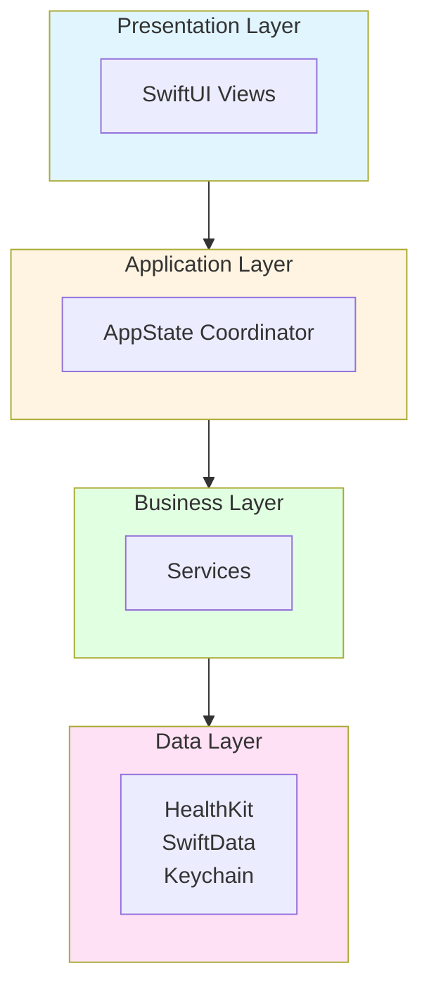
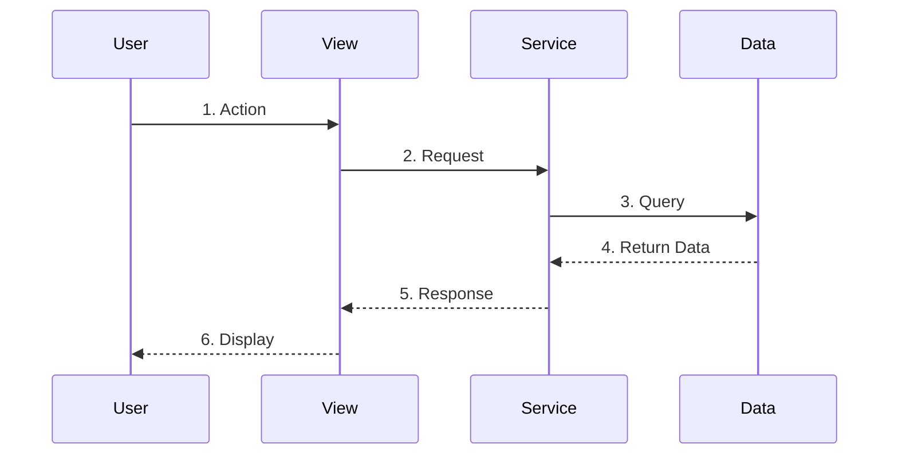
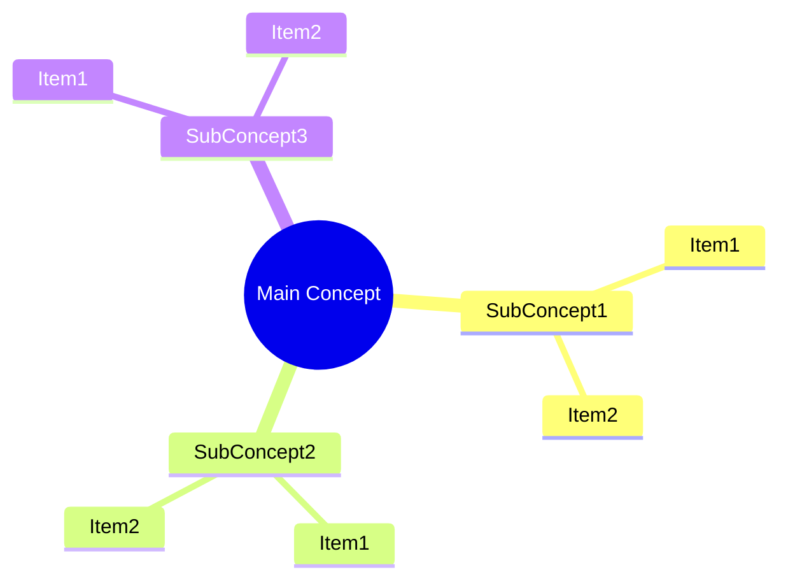
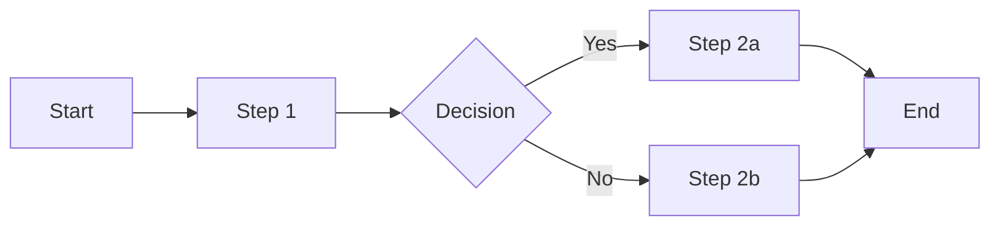
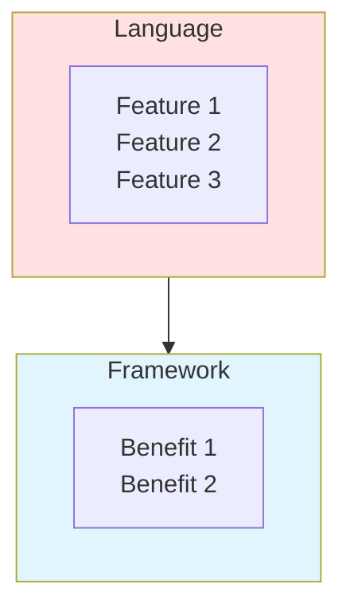
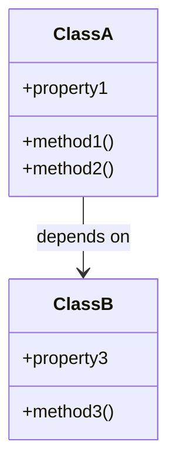

# Documentation Enhancement Template

**Based on Chapters 0-1: Apply this pattern to all remaining chapters**

---

## 📋 Chapter Structure Template

Every chapter should follow this exact structure:

```markdown
# Chapter X: [Chapter Title]

**[Brief subtitle]**

---

## 🎯 Learning Objectives

After this chapter, you will be able to:

- ✅ [Action verb] [specific skill]
- ✅ [Action verb] [specific skill]
- ✅ [Action verb] [specific skill]
- ✅ [Action verb] [specific skill]

**Estimated Time:** [X] minutes

---

## 🧠 Pre-Chapter Check

Before we begin, ask yourself:

- **What do I already know** about [topic]?
- **What confuses me** about [topic]?
- **What do I hope to learn** from this chapter?

*Take 2 minutes to write down your answers. This primes your brain for learning.*

---

## [Section 1 Title]

### [Subsection with Concept]

[Plain English explanation with analogy]

> **Analogy time:** [Simple real-world analogy]

**Key points:**
- Point 1
- Point 2
- Point 3

### Visual Diagram

```mermaid
[Diagram Type]
[Diagram Content]
```

### 🔍 Stop & Think #1

**Before continuing, cover the text above and explain:**

- [Question 1]
- [Question 2]
- [Question 3]

*Don't scroll down until you can explain it!*

---

### ✅ Quick Check: [Section Name]

Check your understanding:

- [ ] [Checkpoint 1]
- [ ] [Checkpoint 2]
- [ ] [Checkpoint 3]
- [ ] [Checkpoint 4]

**If any box is unchecked,** re-read the relevant section before continuing.

---

## [Section 2 Title]

### 📊 I DO: [Worked Example]

Let's [do something] together. Follow along carefully:

```mermaid
[Sequence diagram showing the process]
```

[Detailed explanation with line-by-line breakdown]

### 🔍 Stop & Think #2

**Cover the [diagram/code] above. Explain:**

1. [Question 1]
2. [Question 2]
3. [Question 3]

*Use your own words — no peeking!*

---

## [Section 3 Title]

### 🧪 WE DO: [Guided Practice]

Let's practice [skill] together.

**Task:** [Description]

**Hint:** Think about:
- [Hint 1]
- [Hint 2]

**Try it:**
```bash
# Your command/code here
```

**Solution:**
```bash
# Actual solution
```

### 🚀 YOU DO: [Independent Practice]

**Task:** [More complex task]

*Write your code below before checking the solution.*

<details>
<summary>Click to see solution</summary>

```bash
# Solution with explanation
```

**Bonus:** [Additional tip/variation]
</details>

---

## Code Tour: [Component]

### [Component Name]

**File:** `[path/to/file]`

```swift
// Code example with line numbers
```

**Line-by-line breakdown:**
1. `line 1` = [Explanation]
2. `line 2` = [Explanation]
3. `line 3` = [Explanation]

### ✅ Quick Check: [Section]

Check your understanding:

- [ ] [Checkpoint 1]
- [ ] [Checkpoint 2]
- [ ] [Checkpoint 3]
- [ ] [Checkpoint 4]

---

## 📝 Chapter Exercises

### 🟢 Beginner: [Simple Task]

**Task:** [Description]

**Example Answer:**
> [Example]

**Your Turn:** [Instructions]

---

### 🟡 Intermediate: [Moderate Task]

**Task:** [Description]

**Fill in the blanks:** [Exercise]

**Answers:** [Solutions]

---

### 🔴 Advanced: [Complex Task]

**Task:** [Description]

**Research the code to find your answers.**

---

## Common Pitfalls

### Pitfall 1: "[Wrong belief]"

**Wrong:** [Incorrect approach]

**Right:** [Correct approach]

### Pitfall 2: "[Wrong belief]"

**Wrong:** [Incorrect approach]

**Right:** [Correct approach]

---

## 📝 Teach-Back Checkpoint

**Explain this chapter to:**

1. **A rubber duck** (seriously, it works)
2. **An imaginary 12-year-old**
3. **A non-technical friend**

**Cover these points:**
- [Point 1]
- [Point 2]
- [Point 3]
- [Point 4]

**If you stumble**, review the relevant section. The Feynman Technique is about identifying gaps in your understanding.

---

## 📊 Quick Reference

### Key Concepts

| Concept | Summary |
|---------|---------|
| [Concept 1] | [Summary] |
| [Concept 2] | [Summary] |
| [Concept 3] | [Summary] |

### [Category] Table

| [Item 1] | [Purpose] |
| [Item 2] | [Purpose] |
| [Item 3] | [Purpose] |

### Code Patterns

```swift
// Pattern 1
[Example]

// Pattern 2
[Example]
```

---

## 📈 Spaced Repetition: Review Schedule

To cement this chapter in your long-term memory:

| When | What | Time |
|------|------|------|
| **Tomorrow** | Re-read Quick Reference, do Beginner exercise | 10 min |
| **In 3 days** | Review [specific diagram/concept], explain aloud | 5 min |
| **In 1 week** | Do Intermediate exercise, Teach-Back | 20 min |
| **In 1 month** | Quick review before coding | 5 min |

> **Research:** Spaced repetition dramatically improves long-term retention

---

## 🎯 Chapter Completion Checklist

Before moving to Chapter [X+1], confirm:

- [ ] I explained this chapter to someone (or a rubber duck)
- [ ] I completed at least the Beginner exercise
- [ ] I can [skill check 1]
- [ ] I understand [concept check 2]
- [ ] I know [fact check 3]
- [ ] I've scheduled my first review (tomorrow)

**If any box is unchecked**, review the relevant section before proceeding.

---

## Coming Next

In **Chapter [X+1]: [Next Chapter Title]**, you'll learn:

- [Topic 1]
- [Topic 2]
- [Topic 3]
- [Topic 4]

**Prerequisite:** Make sure you're comfortable with this chapter's concepts before moving on!

---

## Further Reading

### [Category 1]
- [Resource 1](URL)
- [Resource 2](URL)

### [Category 2]
- [Resource 3](URL)
- [Resource 4](URL)

---

**[Encouraging closing statement]**

**Next Chapter:** [Link to next chapter] →
```

---

## 🎨 Mermaid Diagram Templates

### 1. Architecture Diagram (Layered)



**Use for:** Chapter 2 (Architecture), Chapter 3 (Swift 6 actors)

---

### 2. Data Flow Sequence Diagram



**Use for:** Chapter 1 (Data flow), Chapter 4 (SwiftUI), Chapter 8 (Networking)

---

### 3. Concept Mind Map



**Use for:** Chapter 1 (Health data types), Chapter 3 (Swift patterns), Chapter 5 (SwiftData)

---

### 4. Process Flow Graph



**Use for:** Chapter 7 (Security flow), Chapter 9 (CLI commands), Chapter 10 (Testing)

---

### 5. Technology Stack Diagram



**Use for:** Chapter 1 (Tech stack), Chapter 3 (Swift 6), Chapter 4 (SwiftUI)

---

### 6. Class/Structure Diagram



**Use for:** Chapter 5 (SwiftData models), Chapter 6 (HealthKit mapping)

---

## 📝 Active Recall Question Templates

### Pre-Chapter Check

```markdown
## 🧠 Pre-Chapter Check

Before we begin, ask yourself:

- **What do I already know** about [chapter topic]?
- **What confuses me** about [chapter topic]?
- **What do I hope to learn** from this chapter?

*Take 2 minutes to write down your answers.*
```

---

### Stop & Think (During Reading)

```markdown
### 🔍 Stop & Think #[Number]

**Before continuing, cover the text above and explain:**

- [Question testing understanding]
- [Question testing connections]
- [Question testing application]

*Don't scroll down until you can explain it!*
```

**Place every 5-10 minutes of reading time**

---

### Quick Check (After Major Sections)

```markdown
### ✅ Quick Check: [Section Name]

Check your understanding:

- [ ] [Observable fact I should know]
- [ ] [Understanding of why this matters]
- [ ] [Ability to identify key code/patterns]
- [ ] [Ready to proceed marker]

**If any box is unchecked,** re-read the relevant section.
```

---

### Teach-Back (End of Chapter)

```markdown
## 📝 Teach-Back Checkpoint

**Explain this chapter to:**

1. **A rubber duck** (seriously, it works)
2. **An imaginary 12-year-old**
3. **A non-technical friend**

**Cover these points:**
- [Main concept 1]
- [Main concept 2]
- [Main concept 3]
- [Main concept 4]

**If you stumble**, review the relevant section.
```

---

## 🎯 Progressive Scaffolding Templates

### I DO (Worked Example)

```markdown
## 📊 I DO: [Concept Name]

Let's [action] together. Follow along carefully:

```mermaid
[Diagram showing the concept]
```

**Step-by-step breakdown:**

1. **Step 1**: [What happens first]
   - Code: `[example]`
   - Why: [reason]

2. **Step 2**: [What happens next]
   - Code: `[example]`
   - Why: [reason]

**Key insight:** [Important takeaway]
```

---

### WE DO (Guided Practice)

```markdown
## 🧪 WE DO: [Practice Name]

Let's practice [skill] together.

**Task:** [Clear description]

**Hint:** Think about:
- [Hint 1]
- [Hint 2]

**Try it:**
```swift
// Your code here
```

**Solution:**
```swift
// Working solution with explanation
```

**What's happening:** [Breakdown of why it works]
```

---

### YOU DO (Independent Practice)

```markdown
## 🚀 YOU DO: [Challenge Name]

**Task:** [Clear description requiring application]

*[Write your solution before checking below]*

<details>
<summary>Click to see solution</summary>

```swift
// Complete solution
```

**Explanation:** [How it works]

**Bonus:** [Extension idea or variation]
</details>
```

---

## 📊 Quick Reference Templates

### Concepts Table

```markdown
## 📊 Quick Reference

### Key Concepts

| Concept | Summary | Example |
|---------|---------|---------|
| [Concept 1] | [One-line summary] | `[code example]` |
| [Concept 2] | [One-line summary] | `[code example]` |
| [Concept 3] | [One-line summary] | `[code example]` |
```

---

### Technology Comparison

```markdown
### Technology Choices

| Tech | Purpose | Why | When to Use |
|------|---------|-----|-------------|
| [Tech 1] | [Purpose] | [Rationale] | [Use case] |
| [Tech 2] | [Purpose] | [Rationale] | [Use case] |
```

---

### Code Pattern Reference

```markdown
### Code Patterns

| Pattern | Description | Example | File |
|---------|-------------|---------|------|
| `[Name]` | [Description] | `[snippet]` | `[location]` |
```

---

## 📈 Spaced Repetition Schedule Template

```markdown
## 📈 Spaced Repetition: Review Schedule

To cement this chapter in your long-term memory:

| When | What | Time |
|------|------|------|
| **Tomorrow** | Re-read Quick Reference, do Beginner exercise | 10 min |
| **In 3 days** | Review [specific diagram/concept], explain aloud | 5 min |
| **In 1 week** | Do Intermediate exercise, Teach-Back | 20 min |
| **In 1 month** | Quick review before applying to code | 5 min |

> **Research:** Spaced repetition dramatically improves long-term retention — [XMind, 2025](https://xmind.com/blog/learning-strategies)
```

---

## 🎯 Chapter-Specific Guidelines

### For Concept-Heavy Chapters (2, 3, 5, 7)
- More diagrams (2-3 per major concept)
- More analogies
- Slower pace
- More Stop & Think checkpoints

### For Code-Heavy Chapters (4, 6, 8, 9, 10)
- More I DO/WE DO/YOU DO cycles
- Line-by-line code breakdowns
- More code exercises
- Fewer diagrams, more examples

### For Complex Topics (6: HealthKit, 7: Security, 8: Networking)
- Add "Why This Matters" section
- Build intuition before complexity
- Use progressive examples (simple → complex)
- Add troubleshooting sections

---

## 📋 Chapter Enhancement Checklist

Use this checklist when enhancing each chapter:

### Structure
- [ ] Learning Objectives (4 specific, actionable items)
- [ ] Estimated Time
- [ ] Pre-Chapter Check (3 priming questions)
- [ ] 3-5 main sections with clear headings

### Active Recall
- [ ] 3-5 🔍 Stop & Think checkpoints (every ~10 min of reading)
- [ ] 2-3 ✅ Quick Check self-assessments (after major sections)
- [ ] 1 📝 Teach-Back Checkpoint (end of chapter)

### Visual Learning
- [ ] 2-5 Mermaid diagrams appropriate to content
- [ ] Diagrams placed before code/explanation
- [ ] Diagrams use consistent styling

### Scaffolding
- [ ] 1-2 📊 I DO (worked examples)
- [ ] 1-2 🧪 WE DO (guided practice)
- [ ] 1-2 🚀 YOU DO (independent practice)

### Content
- [ ] Code Tour (key files with line numbers)
- [ ] Line-by-line breakdown for complex code
- [ ] Real code references (file:line format)

### Exercises
- [ ] 🟢 Beginner exercise (5-10 min)
- [ ] 🟡 Intermediate exercise (15-20 min)
- [ ] 🔴 Advanced exercise (30-45 min)

### Support Materials
- [ ] 📊 Quick Reference (key concepts/tables)
- [ ] 📈 Spaced Repetition schedule
- [ ] 🎯 Chapter Completion Checklist
- [ ] Further Reading (3-6 resources)

### Common Pitfalls
- [ ] 3-4 common mistakes
- [ ] Wrong vs Right comparisons
- [ ] Practical corrections

---

## 🎨 Mermaid Styling Standards

Use consistent colors for different layer types:

```css
/* Layer Colors */
iOS/Apple:     #e1f5ff (light blue)
Server/Backend: #fff4e1 (light yellow)
Data/Database: #e1ffe1 (light green)
Security:       #ffe1f5 (light pink)
Network:        #f5e1ff (light purple)
UI/Frontend:     #ffe1e1 (light orange)

/* Action Colors */
Start:          #e1ffe1 (green)
End/Success:    #e1ffe1 (green)
Decision:       #fff4e1 (yellow)
Error:          #ffe1e1 (red)
```

---

## ✅ Quality Standards

### John Carmack Principles
- **Clarity over cleverness**: Code should be obvious
- **Correctness first**: It works is more important than fancy
- **No unnecessary complexity**: Simple solutions
- **Practical examples**: Real code, not toy examples

### 2025 Learning Science Standards
- **Active recall**: Every 5-10 minutes
- **Dual coding**: Text + visuals for every concept
- **Spaced repetition**: Review schedule built in
- **Teach-back**: End-of-chapter requirement
- **Progressive scaffolding**: I do → We do → You do

### Documentation Standards
- **Emojis for visual scanning**: 🎯 📊 🧠 📝 ✅ 🟢 🟡 🔴
- **Mermaid diagrams**: Visual learning
- **Code references**: file:line format
- **Research citations**: Back claims with sources

---

## 📚 Applying to Remaining Chapters

### Chapter 2: Architecture
**Focus:** Visual understanding of layers

**Enhancements needed:**
- Mermaid: Layer diagram, communication flow
- Stop & Think: After each layer explanation
- WE DO: Map code to layers together
- Quick Reference: Layer responsibilities table

**Time estimate:** 60 minutes

---

### Chapter 3: Swift 6
**Focus:** Understanding async/await and actors

**Enhancements needed:**
- Mermaid: Actor isolation diagram, async flow
- I DO: Step-by-step async/await conversion
- Stop & Think: After each major concept (actors, Sendable, @Observable)
- Diagrams: Visual explanation of data races vs actors

**Time estimate:** 75 minutes

---

### Chapter 4: SwiftUI
**Focus:** Declarative UI patterns

**Enhancements needed:**
- I DO: Build a view step-by-step
- WE DO: Create a Toggle together
- YOU DO: Build a Form from scratch
- Mermaid: State flow diagram
- Stop & Think: After each view modifier pattern

**Time estimate:** 60 minutes

---

### Chapter 5: SwiftData
**Focus:** Data persistence

**Enhancements needed:**
- Mermaid: ModelContainer schema diagram
- I DO: Create a model step-by-step
- Stop & Think: After @Model explanation
- Quick Reference: Query patterns table

**Time estimate:** 45 minutes

---

### Chapter 6: HealthKit
**Focus:** Health data access (complex!)

**Enhancements needed:**
- Mermaid: Authorization flow diagram
- I DO: Request authorization step-by-step
- Stop & Think: Every 5-10 minutes (complex topic!)
- Troubleshooting section: Common HealthKit issues
- Diagrams: Privacy model visual explanation

**Time estimate:** 60-75 minutes

---

### Chapter 7: Security
**Focus:** Protecting health data (complex!)

**Enhancements needed:**
- Mermaid: Security layers diagram, TLS handshake
- I DO: Set up Keychain storage
- Stop & Think: After each security mechanism
- Quick Reference: Security checklist
- Diagrams: mTLS authentication flow

**Time estimate:** 75 minutes

---

### Chapter 8: Networking
**Focus:** HTTP server implementation (complex!)

**Enhancements needed:**
- Mermaid: Request routing diagram, connection flow
- I DO: Handle an HTTP request step-by-step
- Stop & Think: After each major component
- Sequence diagrams: Request lifecycle
- Quick Reference: HTTP endpoints table

**Time estimate:** 90 minutes

---

### Chapter 9: CLI
**Focus:** Command-line tool

**Enhancements needed:**
- Mermaid: Command flow diagram
- I DO: Parse command-line arguments
- WE DO: Build a subcommand together
- Stop & Think: After ArgumentParser explanation
- Quick Reference: Commands table

**Time estimate:** 45 minutes

---

### Chapter 10: Testing
**Focus:** Swift Testing framework

**Enhancements needed:**
- I DO: Write a unit test step-by-step
- WE DO: Create a mock together
- Stop & Think: After each testing pattern
- Quick Reference: Test patterns table
- Diagrams: Test pyramid visual

**Time estimate:** 60 minutes

---

## 🚀 Implementation Order

**Priority 1 (Critical Concepts):**
1. Chapter 2 (Architecture) - Foundation
2. Chapter 3 (Swift 6) - Language
3. Chapter 6 (HealthKit) - Core feature

**Priority 2 (Important Patterns):**
4. Chapter 7 (Security) - Critical
5. Chapter 8 (Networking) - Complex

**Priority 3 (Supporting Skills):**
6. Chapter 4 (SwiftUI)
7. Chapter 5 (SwiftData)
8. Chapter 10 (Testing)

**Priority 4 (Companion):**
9. Chapter 9 (CLI)

---

## 📝 Quick Enhancement Script

For each chapter:

1. **Copy template** to new chapter file
2. **Replace placeholders** with chapter-specific content
3. **Add Mermaid diagrams** (2-5 per chapter)
4. **Insert Stop & Think** every 5-10 minutes
5. **Add Quick Check** after major sections
6. **Create I DO/WE DO/YOU DO** for code-heavy sections
7. **Write Quick Reference** summary
8. **Add Spaced Repetition** schedule
9. **Include Chapter Checklist**
10. **Review against quality checklist**

---

## ✅ Final Review Checklist

After enhancing a chapter, verify:

- [ ] All 4 learning objectives are specific and actionable
- [ ] Pre-chapter check primes the brain
- [ ] 3-5 Stop & Think prompts force active recall
- [ ] 2-3 Quick Checks validate understanding
- [ ] Mermaid diagrams illustrate key concepts
- [ ] I DO/WE DO/YOU DO progression exists
- [ ] Teach-Back checkpoint at end
- [ ] Quick Reference summarizes key points
- [ ] Spaced repetition schedule included
- [ ] Chapter checklist before "Next Chapter"
- [ ] Research citations where appropriate
- [ ] John Carmack standards maintained
- [ ] Estimated time is accurate

---

## 🎯 Success Metrics

A chapter is fully enhanced when:

1. **Visual learners** have 2-5 diagrams
2. **Active learners** have 3-5 recall opportunities
3. **Kinesthetic learners** have hands-on exercises
4. **Social learners** have teach-back prompts
5. **All learners** have spaced repetition guidance

**Target:** 85% retention after 1 month (vs 20% with passive reading)

---

**End of Template**

Use this template to enhance Chapters 2-10 systematically. Each enhanced chapter should take 30-60 minutes depending on complexity and existing content quality.
