# Architecture Overview

**iOS Health Sync App - System Design and Component Interaction**

---

## High-Level Architecture

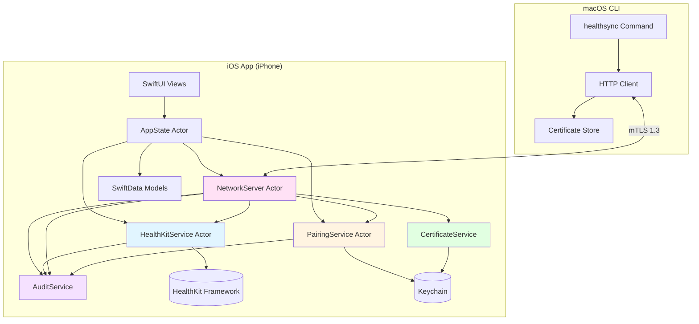

---

## Component Details

📱 Presentation Layer (SwiftUI)

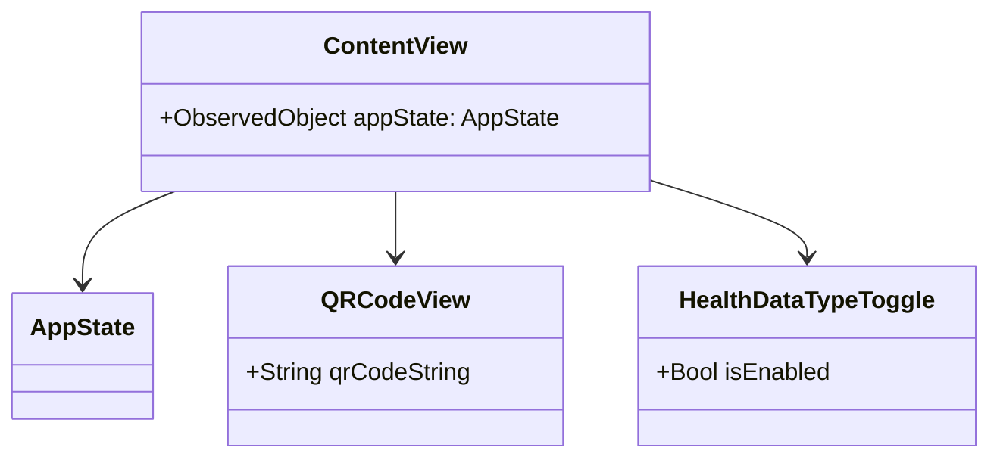

**Purpose:** User interface for the iOS app
**Technologies:** SwiftUI 5.0+, @Observation macro
**Key Responsibilities:**
- Display server status and QR code
- Toggle health data types for sharing
- Show pairing status

🔧 Application Layer

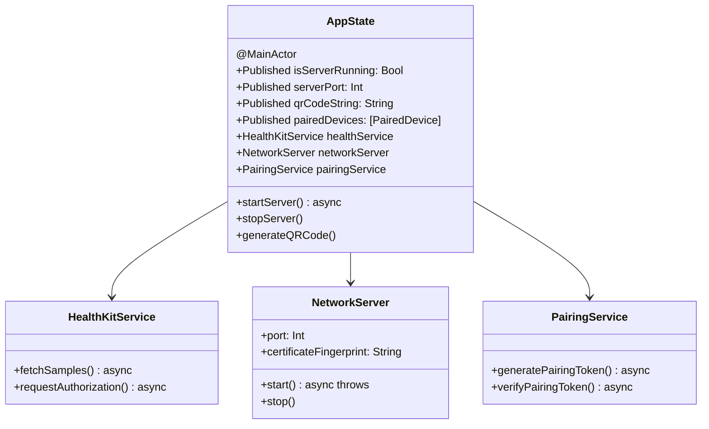

**Purpose:** Business logic and state management
**Key Pattern:** Actor-based concurrency
**Technologies:** Swift 6 async/await, @MainActor

💾 Data Layer

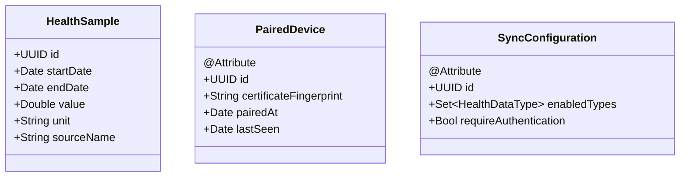

**Purpose:** Data persistence and models
**Technology:** SwiftData (iOS 17+)
**Pattern:** Soft deletes with `deletedAt` timestamp

🌐 Network Layer

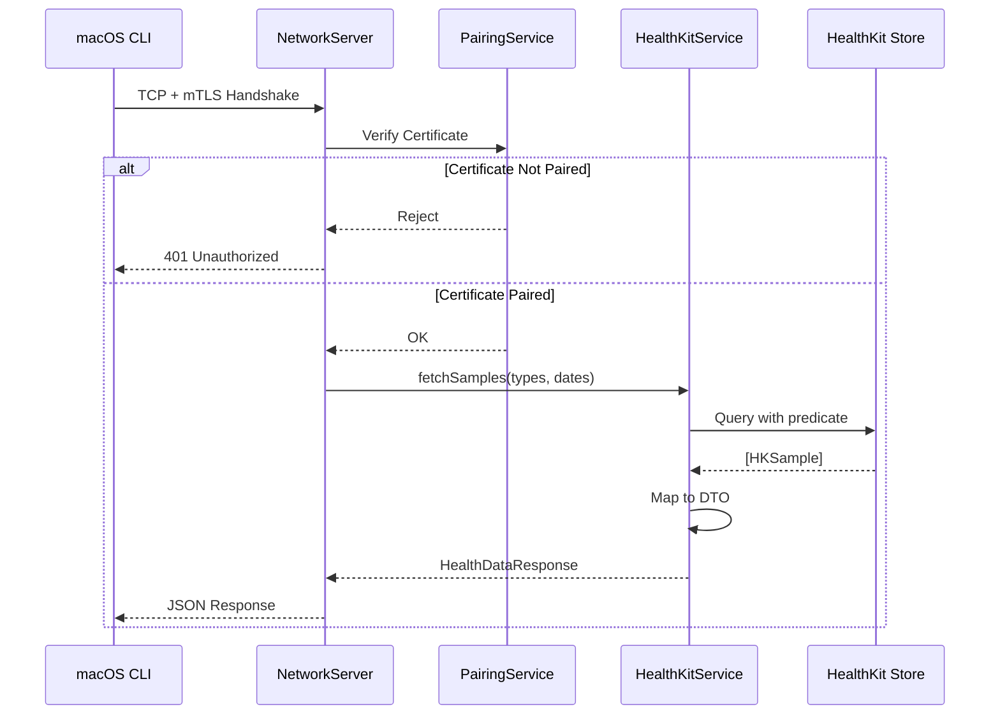

**Security Features:**
- **TLS 1.3 only** - Minimum protocol version enforced
- **Mutual authentication** - Both client and server present certificates
- **Certificate pinning** - Server validates client certificate fingerprint
- **Local network only** - Bonjour discovery on `.local` domain

---

## Data Flow

### Fetching Health Data

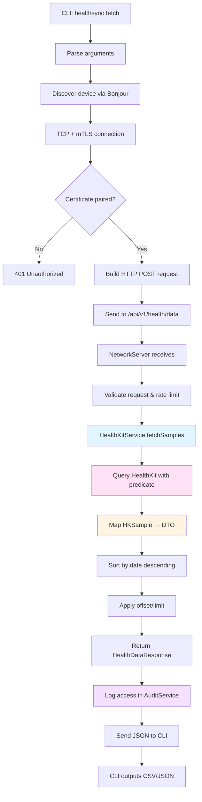

---

### Device Pairing Flow

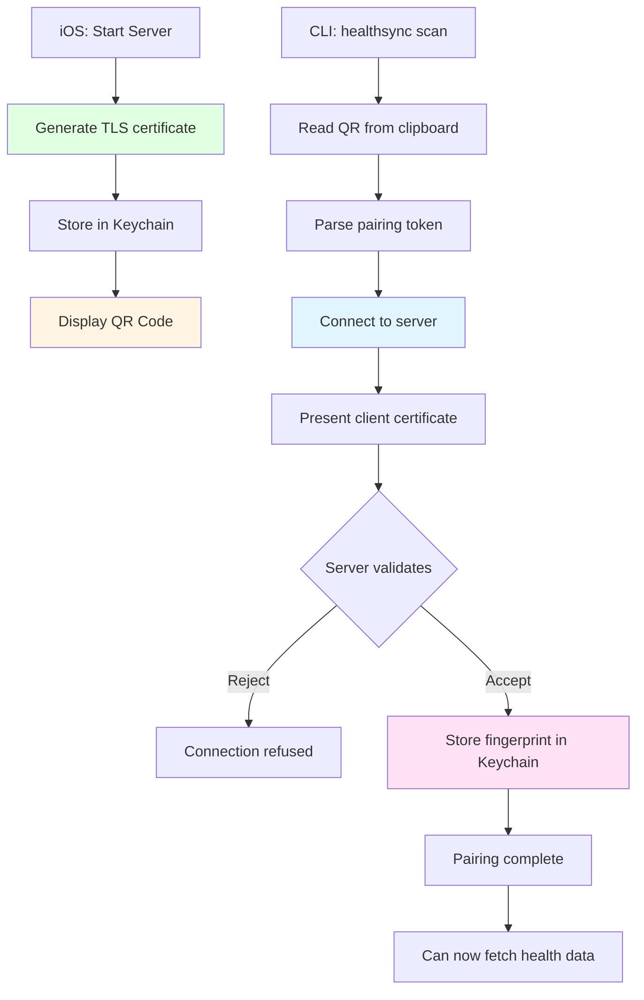

---

🧵 Threading Model

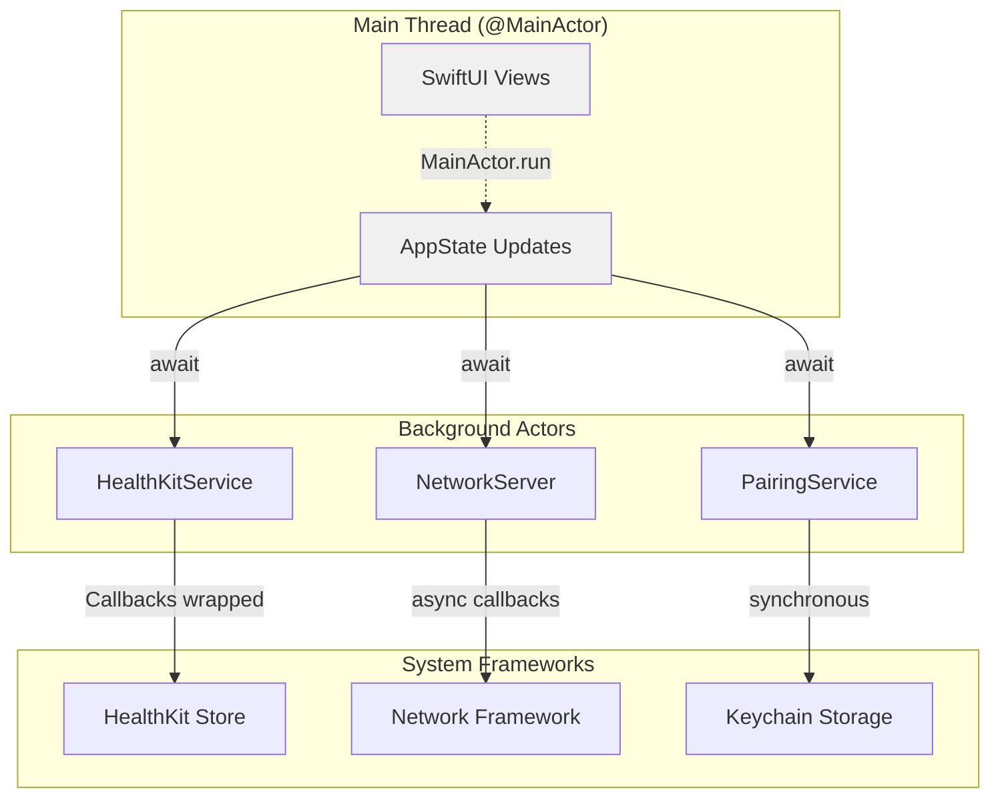

**Key Points:**
- SwiftUI runs on `@MainActor` (main thread)
- All services are actors (thread-safe by default)
- `await` automatically hops between execution contexts
- No manual thread management required

---

🔒 Security Architecture

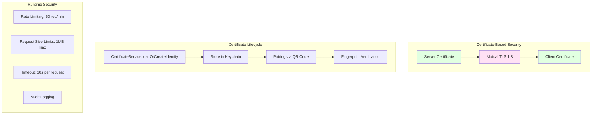

---

💾 Persistence Strategy

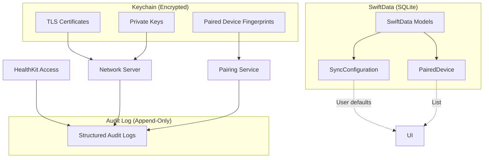

---

## Error Handling Strategy

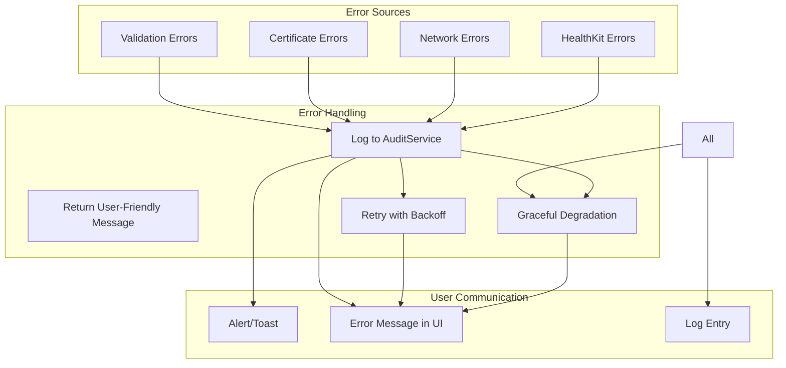

---

## Technology Stack

| Layer | Technology | Version | Purpose |
|-------|-----------|---------|---------|
| **UI** | SwiftUI | 5.0+ | Declarative interface |
| **State** | @Observation macro | iOS 17+ | Automatic state updates |
| **Data** | SwiftData | iOS 17+ | Persistence |
| **Health** | HealthKit | iOS 17+ | Health data access |
| **Network** | Network Framework | iOS 17+ | TLS server |
| **Crypto** | CryptoKit | iOS 17+ | Certificate handling |
| **Storage** | Keychain | - | Secure certificate storage |
| **Logging** | os.logger | - | Structured logging |
| **CLI** | Swift Package Manager | 6.0+ | Command-line tool |

---

## Design Patterns Used

1. **Actor Pattern** - All services are actors for thread safety
2. **Dependency Injection** - Services injected via init
3. **Protocol-Oriented** - `HealthStoreProtocol` for testability
4. **Repository Pattern** - SwiftData models abstract data access
5. **Observer Pattern** - @Observation for UI updates
6. **Strategy Pattern** - Pluggable identity providers for certificates

---

## See Also

- **[Swift 6 Concurrency](../learn/03-swift6.md)** - How actors work
- **[Network Server API](./api/network-server.md)** - Server endpoints
- **[Security Model](./security.md)** - Certificate-based pairing
- **[Data Flow](./data-flows.md)** - Request/response lifecycle

---

**Architecture Documentation Version:** 1.0.0
**Last Updated:** 2026-01-07
**App Version:** 1.0.0
