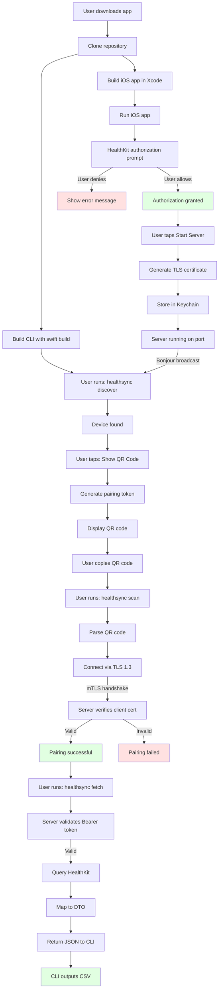
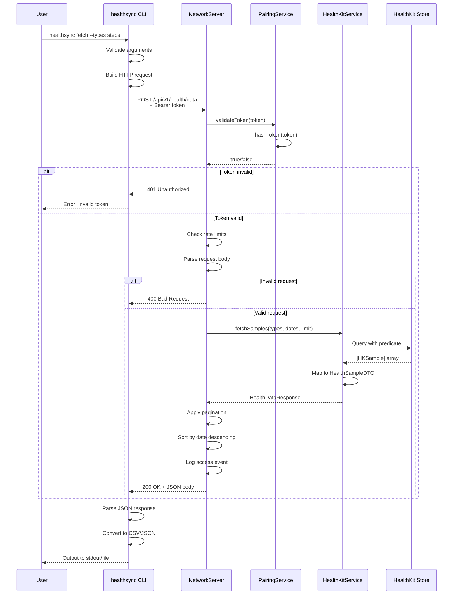
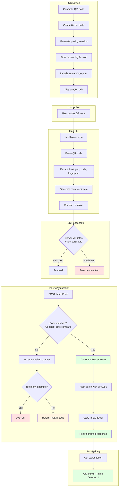
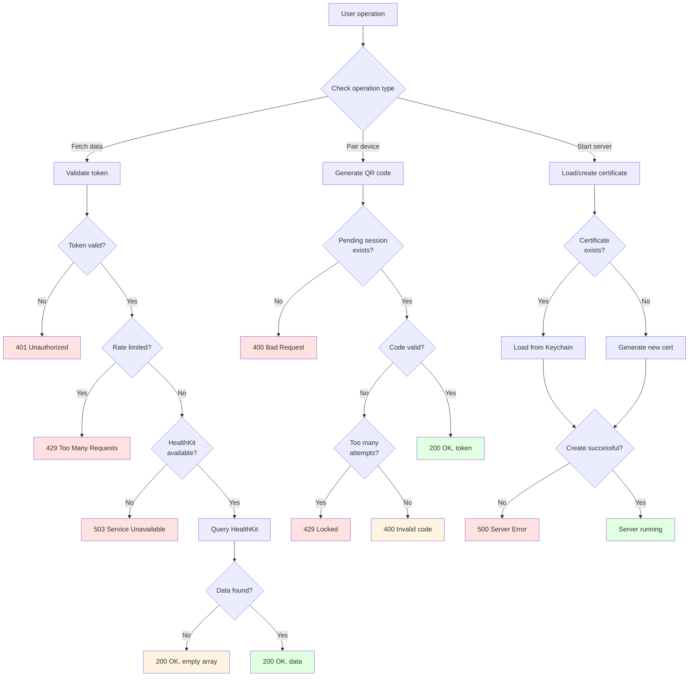
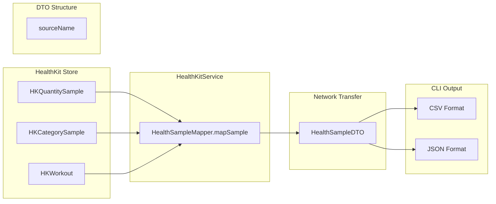
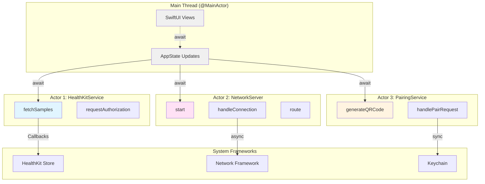
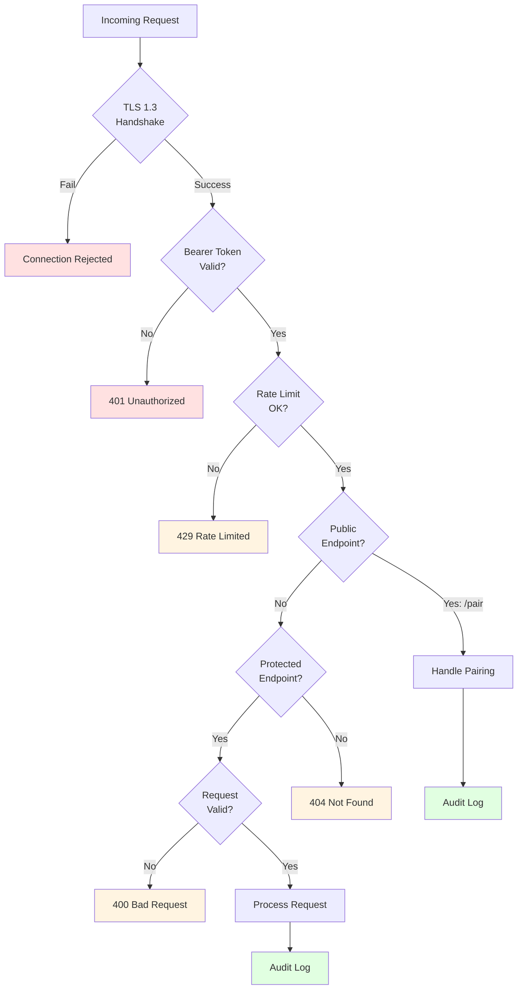
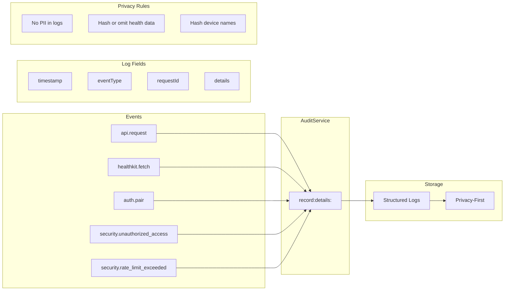

# Data Flow Diagrams

**Visual guides for understanding how data moves through the system**

---

## Overview

This document provides detailed data flow diagrams for the key operations in iOS Health Sync. Each diagram shows:

- 🔄 **Data flow** - How data moves between components
- 🔐 **Security boundaries** - Where authentication/encryption happens
- ⚠️ **Error paths** - How failures are handled
- 📊 **Data transformations** - How data changes format

---

## 1. Complete User Journey: First-Time Setup

This diagram shows the complete flow from a new user to their first successful health data fetch.



**Key Points:**
- User must grant HealthKit authorization before any data access
- TLS certificate is generated automatically on first run
- QR code expires after 5 minutes for security
- mTLS handshake requires both certificates to be valid
- Every fetch request validates the Bearer token

---

## 2. HealthKit Data Fetch Flow

Detailed flow of a single health data fetch operation.



**Error Handling:**
- **401 Unauthorized**: Token expired or invalid → User needs to re-pair
- **400 Bad Request**: Invalid parameters → User needs to fix command
- **429 Too Many Requests**: Rate limit exceeded → User needs to wait
- **500 Server Error**: HealthKit error → Check logs

---

## 3. Device Pairing Flow

Complete flow of secure device pairing with QR code.



**Security Features:**
- QR code expires in 5 minutes
- Maximum 5 failed attempts, then lockout
- Constant-time comparison prevents timing attacks
- Only token hash stored (never the token itself)
- Client name anonymized before storage

---

## 4. Certificate Lifecycle

Flow of TLS certificate creation, storage, and usage.

```mermaid
stateDiagram-v2
    [*] --> CheckKeychain: App starts

    CheckKeychain --> Exists: Certificate found
    CheckKeychain --> CreateNew: Not found

    Exists --> LoadCert: Load certificate
    Exists --> VerifyFingerprint: User verifies

    CreateNew --> GenerateKey: Generate ECDSA P-256 key
    GenerateKey --> StoreKey: Store in Keychain
    StoreKey --> BuildCert: Build self-signed cert
    BuildCert --> StoreCert: Store in Keychain
    StoreCert --> CreateIdentity: Create SecIdentity
    CreateIdentity --> CalculateFingerprint: SHA256 hash
    CalculateFingerprint --> [*]

    LoadCert --> CreateIdentity
    VerifyFingerprint --> [*]

    stateDiagram-v2
        [*] --> ServerStart: Server.start()
        ServerStart --> Listening: NWListener created
        Listening --> Connected: Client connects
        Connected --> Handshake: TLS 1.3 handshake
        Handshake --> Authenticated: mTLS success
        Handshake --> Rejected: Certificate invalid
        Authenticated --> Processing: Request routed
        Processing --> Listening: Request complete
        Rejected --> [*]
```

**Keychain Storage:**
- Private key stored with Secure Enclave (if available)
- Certificate stored separately
- Both encrypted at rest by iOS
- Access controlled by app entitlements

---

## 5. Error Recovery Flows

How the system handles various error conditions.



**HTTP Status Codes Used:**
- **200 OK**: Success
- **400 Bad Request**: Invalid input
- **401 Unauthorized**: Invalid/expired token
- **404 Not Found**: Unknown route
- **413 Payload Too Large**: Request body too large
- **429 Too Many Requests**: Rate limit exceeded
- **500 Server Error**: Internal error
- **503 Service Unavailable**: HealthKit unavailable

---

## 6. Data Transformation Pipeline

How health data transforms from HealthKit to CLI output.



**Data Mappings:**

| HealthKit Type | DTO Type | Value Mapping |
|---------------|----------|---------------|
| Steps (Quantity) | steps | count |
| Heart Rate (Quantity) | heartRate | bpm |
| Sleep Analysis (Category) | sleep | value (asleep, inBed) |
| Workout | workout | duration + type |
| Distance (Quantity) | distance | meters |

---

## 7. Concurrency and Threading

How Swift 6 concurrency manages parallel operations.



**Concurrency Safety:**
- Actors prevent data races automatically
- `@MainActor` ensures UI updates on main thread
- `await` hops between execution contexts
- No manual thread management needed

---

## 8. Security Boundaries

Where security checks happen in the data flow.



**Security Layers:**
1. **TLS 1.3**: Encryption and certificate validation
2. **Bearer Token**: Authentication for protected endpoints
3. **Rate Limiting**: DDoS protection (60 req/min)
4. **Input Validation**: Prevent injection attacks
5. **Audit Logging**: Track all access for security monitoring

---

## 9. Audit Trail Flow

How all health data access is logged.



**Logged Events:**
- Every API request
- Every HealthKit fetch
- All pairing attempts
- All security events (unauthorized access, rate limits)
- All errors and failures

---

**Data Flow Diagrams Version:** 1.0.0
**Last Updated:** 2026-01-07

---

For more details, see:
- [Architecture Overview](architecture.md)
- [API Documentation](api/)
- [Security Guide](../explanation/security.md)
